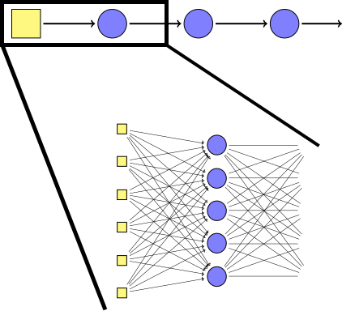
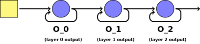
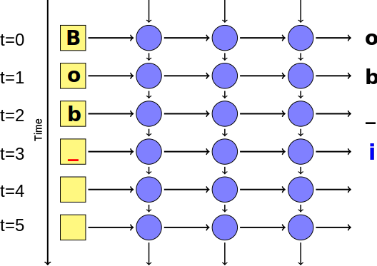
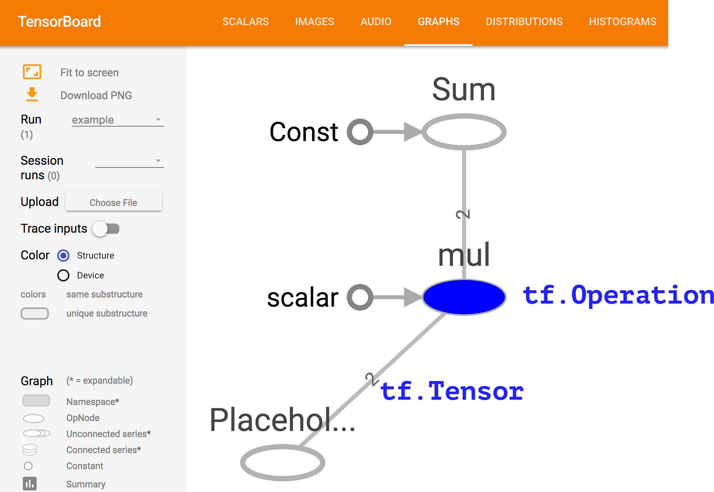
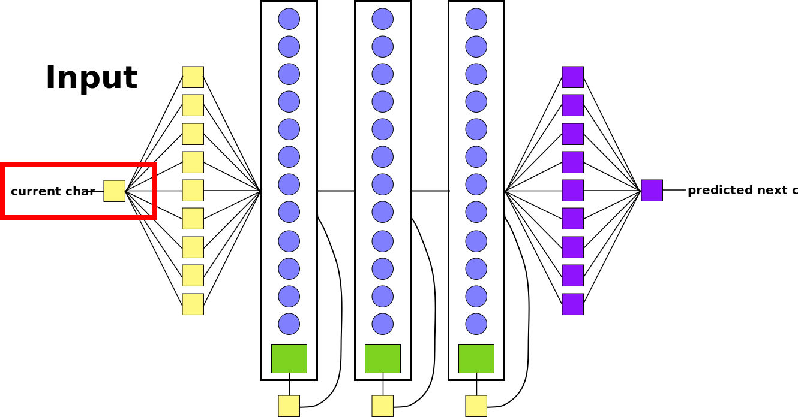
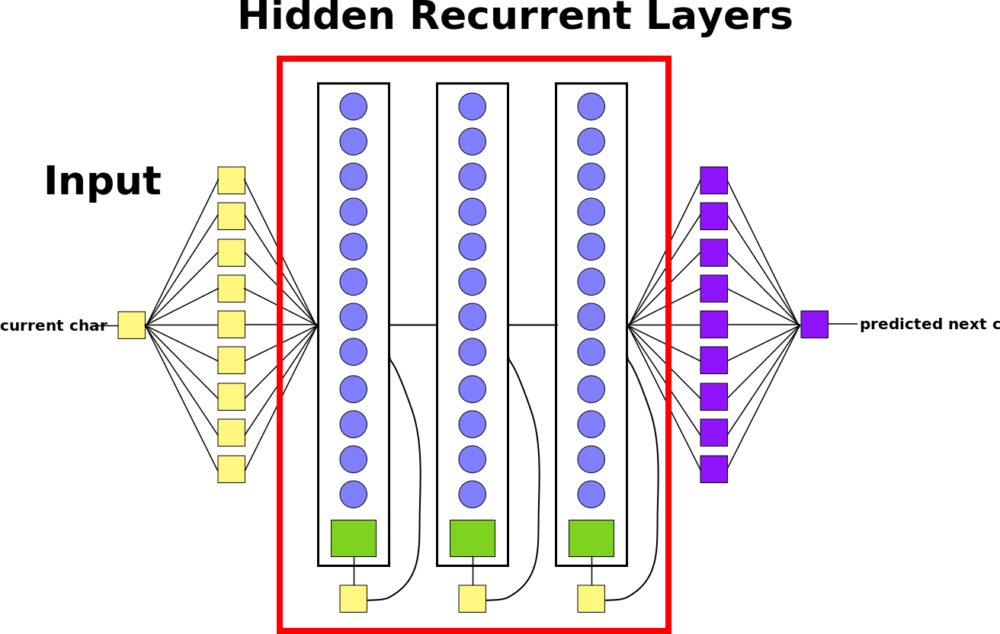
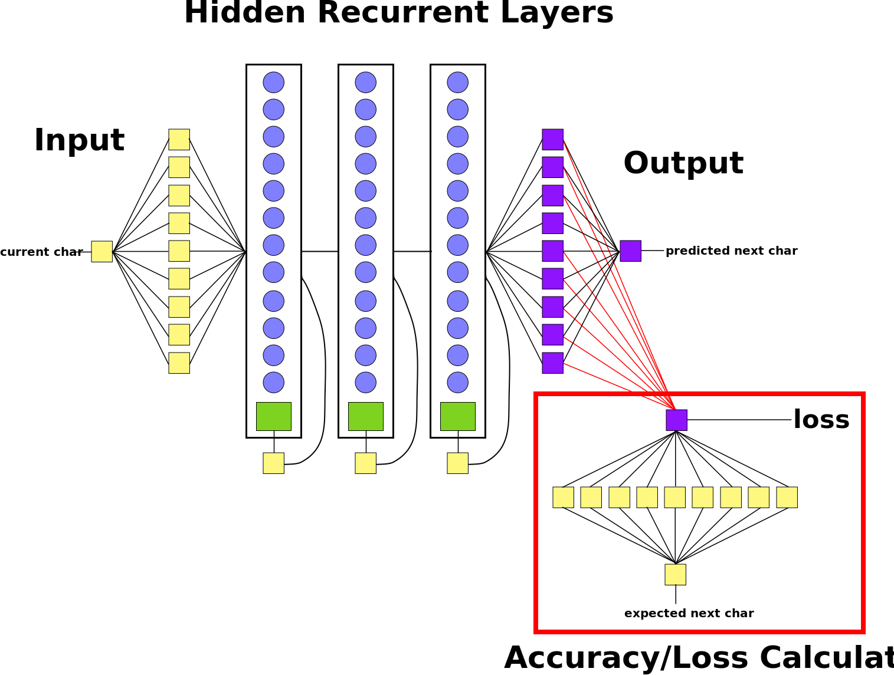

<!-- .slide: data-background="images/books_opened.jpg" class="background" -->

<h2>Industrial Machine Learning</h2>
<h4>Horizontally scalable Machine Learning in Python</h4>
<p>
  <br />
  <br />
    Alejandro Saucedo <br/><br/>
    <a href="http://twitter.com/AxSaucedo">@AxSaucedo</a><br/>
    <a href="http://linkedin.com/in/AxSaucedo">in/axsaucedo</a><br/>
  <br />
</p>
<p>

[NEXT]
<!-- .slide: data-background="images/books_opened.jpg" class="background" -->

### About Me

<table class="bio-table">
  <tr>
    <td style="float: left"></td>
    <td style="float: left; color: white">
        <br>
        <font style="font-weight: bold">Alejandro Saucedo</font>
        <br>
        <br>
        CTO, <a href="#">Exponential Tech</a>
        Head of Eng Dept, <a href="#">Eigen</a>
        Fellow (AI & ML), <a href="#">The RSA</a>
    </td>
  </tr>
  <tr>
  </tr>
</table>

[NEXT]
<!-- .slide: data-background="images/books_opened.jpg" class="background smallquote" -->

# Industry-ready ML

> Theoretical ML crashcourse
>
> Knowledge around distributed ML frameworks
> 
> Learning by example. Today we are...

## Building a tech startup

[NEXT]
<!-- .slide: data-background="images/books_opened.jpg" class="background smallquote" -->

# Crypto-ML Ltd.

> Let's jump the hype-train! 
> <br>
> <br>
> A ML framework for <font style="color: cyan">crypto-data</font>
>
> Supporting <font style="color: cyan">heavy compute/memory ML</font>
>
> Can our system survive the <font style="color: cyan">crypto-craze?</font>


[NEXT]
<!-- .slide: data-background="images/books_opened.jpg" class="background smallquote" -->

# The Dataset

> All historical data from top 100 cryptos
>
> Data goes from beginning to 11/2017

> 563871 daily-price (close) points 
>
> <font style="font-weight: bold; color: cyan">Objectives:</font>
<font style="color: white">
* Supporting heavy ML computations
* Supporting increasing traffic 

</font>


[NEXT]
<!-- .slide: data-background="images/books_opened.jpg" class="background smallquote" -->

# Let's build

> A set of simple ML and heavier DL models
> <br>
> <br>
> A containerised system for deployment
>
> A distributed ML architecture
>
> An elastically scalable setup

## In Python (+ others)

[NEXT]
<!-- .slide: data-background="images/books_opened.jpg" class="background smallquote" -->

# The Result

> A set of simple ML and DL models
> <br>
> <br>
> A Dockerfile and docker-compose file
>
> A manager-worker architecture with celery
> 
> A kubernetes cluster that scales the build

[NEXT]
<!-- .slide: data-background="images/books_opened.jpg" class="background smallest" -->

## Interface: CryptoLoader

<pre><code class="code python hljs" style="font-size: 1em; line-height: 1em">
from crypto_ml.data_loader import CryptoLoader cl

loader = cl()

loader.get_prices("bitcoin")
> array([ 134.21,  144.54,  139.  , ..., 3905.95, 3631.04, 3630.7 ])


loader.get_df("bitcoin").head()
>            Date    Open    High     Low   Close     Market Cap
> 1608 2013-04-28  135.30  135.98  132.10  134.21  1,500,520,000
> 1607 2013-04-29  134.44  147.49  134.00  144.54  1,491,160,000
> 1606 2013-04-30  144.00  146.93  134.05  139.00  1,597,780,000
> 1605 2013-05-01  139.00  139.89  107.72  116.99  1,542,820,000
> 1604 2013-05-02  116.38  125.60   92.28  105.21  1,292,190,000

</code></pre>

<div class="clear-col"></div>


[NEXT]
<!-- .slide: data-background="images/books_opened.jpg" class="background smallest" -->

## Interface: CryptoManager

<pre><code class="code python hljs" style="font-size: 1em; line-height: 1em">
from crypto_ml.manager import CryptoManager as cm

manager = cm()

manager.send_tasks()

> bitcoin [[4952.28323284 5492.85474648 6033.42626011 6573.99777374 7114.56928738
> 7655.14080101 8195.71231465 8736.28382828 9276.85534192 9817.42685555]]
> bitconnect [[157.70136155 181.86603134 206.03070113 230.19537092 254.36004071
> 278.5247105  302.6893803  326.85405009 351.01871988 375.18338967]]

</code></pre>

<div class="clear-col"></div>

<!-- .element style="color: white;" -->


[NEXT]
## #LetsDoThis

[NEXT SECTION]
# 1. Machine Learning Theory

[NEXT]

Crypto-ML Ltd. managed to appear in top tech magazines and raise VC money with their initial prototype.

<pre><code class="code python hljs" style="font-size: 1em; line-height: 1em">
import random

def predict_crypto(self, crypto_data):
    # I have no clue what I'm doing
    return crypto_data * random.uniform(0, 1)

</code></pre>

<br>

### Now they need to figure out what ML is


[NEXT]

### ML Tutorials Everywhere


[NEXT]
Given some input data, predict the correct output


Let's try to predict whether a shape is a square of a triangle

### How do we do this?

[NEXT]
## Let's visualise it

* Imagine a 2-d plot
* The x-axis is the area of the input shape
* The y-axis is the perimeter of the input shape


[NEXT]
## All about the function

<div class="left-col">
**$f(x̄) = mx̄ + b$**, where:
<br>
<br>
**x̄** is input (area & perimeter) </li>
<br>
<br>
**m** and **b** are weights/bias
<br>
</div>


The result **$f(x̄)$** states whether it's a triangle or square
<br>
<br>
(i.e. if it's larger than 0.5 it's triangle otherwise square)

[NEXT]
### We let the machine do the learning


[NEXT]
### We let the machine do the learning


[NEXT]
### We let the machine do the learning


[NEXT]
### Minimising loss function

We optimise the model by **minimising its loss**.

Keep adjusting the weights...

...until loss is not getting any smaller.


[NEXT]
### Finding the weights!


When it finishes, we find optimised weights and biases

i.e. **$f(x̄)$ = triangle  if ($0.3 x̄ + 10$) > 0.5 else square**

[NEXT]
### Now predict new data


Once we have our function, we can predict NEW data!


[NEXT]
### We're ML experts!

Please collect your certificates after the talk
<br>
<br>

These are valid in:

* Your Linkedin profile
* Non-tech Meetups and Parties
* Any time you reply to a tweet

[NEXT]

### In all seriousness...

`f(x) = mx + b`  

is the single perceptron function

in a neural network
<br>


[NEXT]
### Instead of just one neuron


[NEXT]
### We just have many


This gives the function more flexibility


[NEXT]
### With a few layers


This gives more flexibility for learning


[NEXT]
But what about with more complex cases?


[NEXT]

### Deep Neural Networks 


[NEXT]
### Deep Networks &mdash; many hidden layers


[NEXT]


[NEXT]


[NEXT]


[NEXT]


[NEXT SECTION]
# 2. Machine Learning in Practice


[NEXT]
The real world has more varied and complex cases

You need a pragmatic approach

<div class="right-col">

</div>

<br>
<div class="left-col">
<ul>
<li> Extending our feature space</li>
<li> Increasing number of inputs</li>
<li> Regularisation techniques (dropout, batch normalisation)</li>
<li> Normalising datasets</li>
</ul>

</div>


[NEXT]
The Crypto-ML devs asked themselves...

<pre><code class="code python hljs" style="font-size: 1em; line-height: 1em">
from crypto_ml.data_loader import CryptoLoader

btc = CryptoLoader().get_df("bitcoin")

btc.head()

>            Date    Open    High     Low   Close     Market Cap
> 1608 2013-04-28  135.30  135.98  132.10  134.21  1,500,520,000
> 1607 2013-04-29  134.44  147.49  134.00  144.54  1,491,160,000
> 1606 2013-04-30  144.00  146.93  134.05  139.00  1,597,780,000
> 1605 2013-05-01  139.00  139.89  107.72  116.99  1,542,820,000
> 1604 2013-05-02  116.38  125.60   92.28  105.21  1,292,190,000


</code></pre>

We are now experts in ML, however...

...can this be used for our cryptocurrency price data?

[NEXT]
# Not yet.

Processing sequential data requires a different approach.
<br>
<br>

Instead of trying to predict two classes...

...we want to predict future steps
<br>
<br>

#### How do we do this?

[NEXT]

# Sequential Models

Sequential models often are used to predict future data.

<div class="left-col">

</div>

<div class="right-col">
Still uses the same approach
<br>

`f(x) = mx + b`  
<br>
To find the weights and biases
<br>
<br>

But can be used on time-sequence data - ie. prices, words, characters, etc.
</div>


[NEXT]

## The hello_world of ML

Predicting prices by fitting a line on set of time-series points


### Linear Regression


[NEXT]

# Linear Regression

<pre><code class="code python hljs" style="font-size: 1em; line-height: 1em">
from sklearn import linear_model


def predict(prices, times, predict=10):

    model = linear_model.LinearRegression()

    model.fit(times, prices)

    predict_times = get_prediction_timeline(times, predict)

    return model.predict(predict_times)

</code></pre>

[NEXT]
# Linear Regression

<pre><code class="code python hljs" style="font-size: 1em; line-height: 1em">
from crypto_ml.data_loader import CryptoLoader


cl = CryptoLoader()

df = cl.get_df("bitcoin")

times = df[["Date"]].values
prices = df[["Price"]].values

results = predict(prices, times, 5)

</code></pre>

### Success

[NEXT]
### But the Crypto-ML team wants 
#cutting edge tech

[NEXT]

# Deep Recurrent 
# Neural Networks 

[NEXT]

### Deep Recurrent Neural Networks
They are pretty much deep neural networks.
<br>
<br>

But their use is to predict a future time-step...

...instead of predicting a class.


[NEXT]
### Deep Recurrent Neural Networks

Because of the layers and neurons:

* They can hold more complex functions/models.

* They can take more complex features.

* They require more data

[NEXT]
### Let's recall deep neural nets


[NEXT]
### Simplified Visualisation

One node represents a full layer of neurons.

[NEXT]
### Simplified Visualisation


One node represents a full layer of neurons.


[NEXT]
### Unrolled Recurrent Network
Previous predictions help make the _next_ prediction.

Each prediction is a **time step**.


[NEXT]
### Recurrent Networks



Hidden layer's input includes the output of itself during the last run of the
network.


[NEXT]


[NEXT]


[NEXT]


[NEXT]


[NEXT]


[NEXT]


[NEXT]


[NEXT]

### Loss/Cost function
Cost function is based on getting the prediction right!


[NEXT]
### Deep learning framework

We are building this example with Keras


<br>

#### There are many others to choose from


[NEXT]
### Training an RNN in Python

<pre><code class="code python hljs" style="font-size: 0.8em; line-height: 1em">
import utils


def deep_predict(prices, times, predict=10):

    model = utils.get_rnn_model()

    model.fit(time, prices, batch_size=512, nb_epoch=1, validation_split=0.05)

    predict_times = get_prediction_timeline(times, predict)

    return model.predict(predict_times)

</code></pre>

* Build model
* Compute the weights
* Return the prediction


[NEXT]
### Not too different, eh!

<pre><code class="code python hljs" style="font-size: 0.8em; line-height: 1em">
from sklearn import linear_model


def predict(prices, times, predict=10):

    model = linear_model.LinearRegression()

    model.fit(times, prices)

    predict_times = get_prediction_timeline(times, predict)

    return model.predict(predict_times)

</code></pre>


<pre><code class="code python hljs" style="font-size: 0.8em; line-height: 1em">
import utils


def deep_predict(prices, times, predict=10):

    model = utils.get_rnn_model()

    model.fit(time, prices, batch_size=512, nb_epoch=1, validation_split=0.05)

    predict_times = get_prediction_timeline(times, predict)

    return model.predict(predict_times)

</code></pre>


[NEXT]
### To build the LSTM

<pre><code class="code python hljs" style="font-size: 0.8em; line-height: 1em">
from keras.layers.core import Dense, Activation, Dropout
from keras.layers.recurrent import LSTM
from keras.models import Sequential
import lstm

def get_rnn_model():
    model = Sequential()
    model.add(LSTM(input_dim=1, output_dim=50, return_sequences=True))
    model.add(Dropout(0.2))

    model.add(LSTM(100, return_sequences=False))
    model.add(Dropout(0.2))

</code></pre>

In this case 50 recurrent layers that pass output to next layer...

...and 100 that don't pass output until end of sequence

(+ regulatisation)


[NEXT]
### Finishing the model

<pre><code class="code python hljs" style="font-size: 0.8em; line-height: 1em">
from keras.layers.core import Dense, Activation, Dropout
from keras.layers.recurrent import LSTM
from keras.models import Sequential
import lstm

def get_rnn_model():
    model = Sequential()
    model.add(LSTM(input_dim=1, output_dim=50, return_sequences=True))
    model.add(Dropout(0.2))

    model.add(LSTM(100, return_sequences=False))
    model.add(Dropout(0.2))

    model.add(Dense(output_dim=1))
    model.add(Activation('linear'))

    model.compile(loss="mse", optimizer="rmsprop")

    return model

</code></pre>

A linear dense layer to aggregate the data into a single value

Compile with mean sq. error & gradient descent as optimizer

Simple!


[NEXT]
# RNN Test-run

<pre><code class="code python hljs" style="font-size: 1em; line-height: 1em">
from crypto_ml.data_loader import CryptoLoader


cl = CryptoLoader()

df = cl.get_df("bitcoin")

times = df[["Date"]].values
prices = df[["Price"]].values

results = deep_predict(prices, times, 5)

</code></pre>


### Success

[NEXT]

# Crypto has the ML

Are we done?

# No.

The fun is just starting


[NEXT SECTION]

# 3. Distributed Architecture

[NEXT]

After CryptoML was caught using deep learning...

...they were featured in the top 10 global news

[NEXT]

## Their userbase exploded

Now they have 100s of users coming in every day 

Each user is running several ML algorithms every second

They tried getting larger and larger AWS servers

[NEXT]
## They should've seen this coming

* Machine learning is known for being computing heavy
* But often it's forgotten how memory-heavy it is
* I'm talking VERY heavy - holding whole models in-mem
* Scaling to bigger instances with more cores is expensive
* Having everything in one node is a central point of failure

<br>
### It's time to go distributed

[NEXT]
### Producer-consumer Architecture


The Crypto-ML Devs thought go distributed was too hard

**It's not.**

[NEXT]
# Introducing Celery


* Distributed
* Asynchronous
* Task Queue
* For Python

[NEXT]
## Step 1: Take your code

<pre><code class="code python hljs" style="font-size: 0.8em; line-height: 1em">

def deep_predict(prices, times, predict=10):

    model = utils.get_rnn_model()

    model.fit(time, prices, batch_size=512, nb_epoch=1, validation_split=0.05)

    predict_times = get_prediction_timeline(times, predict)

    return model.predict(predict_times)

</code></pre>

[NEXT]
## Step 2: Celerize it

<pre><code class="code python hljs" style="font-size: 0.8em; line-height: 1em">

@app.task
def deep_predict(prices, times, predict=10):

    model = utils.get_rnn_model()

    model.fit(time, prices, batch_size=512, nb_epoch=1, validation_split=0.05)

    predict_times = get_prediction_timeline(times, predict)

    return model.predict(predict_times)

</code></pre>

[NEXT]
## Step 3: Make sure it works

<pre><code class="code python hljs" style="font-size: 0.8em; line-height: 1em; ">
from celery import Celery
from utils import load, dump

app = Celery('crypto_ml',
    backend='amqp://guest@localhost/',    
    broker='amqp://guest@localhost/')

@app.task
def deep_predict(d_prices, d_times, predict=10):

    # Load from stringified binaries (Pandas Dataframes)
    prices = load(d_prices)
    times = load(d_times)

    model = utils.get_rnn_model()

    model.fit(time, prices, batch_size=512, nb_epoch=1, validation_split=0.05)

    predict_times = get_prediction_timeline(times, predict)

    return dump(model.predict(predict_times))

</code></pre>

Disclaimer: I haven't for this snippet

[NEXT]
## Step 4: Run it!

<pre><code class="code bash hljs" style="font-size: 0.8em; line-height: 1em; ">
$ celery -A crypto_ml worker

</code></pre>

See the activity logs:

``` bash
Darwin-15.6.0-x86_64-i386-64bit 2018-03-10 00:43:28

[config]
.> app:         crypto_ml:0x10e81a9e8
.> transport:   amqp://user:**@localhost:5672//
.> results:     amqp://
.> concurrency: 8 (prefork)
.> task events: OFF (enable -E to monitor tasks in this worker)

[queues]
.> celery           exchange=celery(direct) key=celery

```


[NEXT]

## We're already halfway there

Now we just need to make the producer!

**We can just follow the same recipe**

[NEXT]

## Step 1: Take the code

<pre><code class="code python hljs" style="font-size: 0.8em; line-height: 1em; ">
cl = CryptoLoader()
results = {}

# Compute results
for name in cl.get_crypto_names():

    prices, times = cl.get_prices(name)

    result = deep_predict(prices, times)

    results[name] = result

# Print results
for k,v in results.items():
    print(k, v)


</code></pre>

[NEXT]
## Step 2: Celerize it

<pre><code class="code python hljs" style="font-size: 0.8em; line-height: 1em; ">
cl = CryptoLoader()
results = {}

# Send task for distributed computing
for name in cl.get_crypto_names():

    prices, times = cl.get_prices(name)

    task = deep_predict.delay(
                      dump(prices)
                    , dump(times))

    results[name] = task

# Wait for results and print
for k,v in results.items():
    p_result = v.get()

    result = load(p_result)

    print(k, result)

</code></pre>

[NEXT]
## Step 3: Make sure it works

<pre><code class="code python hljs" style="font-size: 0.8em; line-height: 1em; ">from crypto_ml.data_loader import CryptoLoader
from util import load, dump

cl = CryptoLoader()
results = {}

# Send task for distributed computing
for name in cl.get_crypto_names():

    prices, times = cl.get_prices(name)

    task = deep_predict.delay(
                      dump(prices)
                    , dump(times))

    results[name] = task

# Wait for results and print
for k,v in results.items():
    p_result = v.get()

    if result:
        result = load(p_result)
        print(k, result)

</code></pre>

Disclaimer: I haven't for this snippet


[NEXT]
## Step 4: Run it!

By just running the Python in a shell command!


[NEXT]

# Visualise it

You can visualise through Celery "Flower"

``` bash
$ celery -A crypto_ml flower
> INFO: flower.command: Visit me at http://localhost:5555
```


[NEXT]
# Distriuted #Win

We now have ML, and are distributed.

We have surely won.

### Not really 

Having a horizontal architecture is just the first step...

Now we have to take full advantage of it!


[NEXT SECTION]
# 4. Elastic Infrastructure


[NEXT]
The CryptoML team remembers the easy days...

...when they only had 100 new users a day

Now they have thousands and thousands!

They are working with multi-billion $ firms!

They are processing millions of ML requests!

<br>
### Their infrastructure isn't keeping up


[NEXT SECTION]
## 5. Neural Nets in Python

[NEXT]
Building a neural network involves:

1. defining its architecture
2. learning the weight matrices for that architecture

_note_
1. e.g. number of layers, whether to have loops, what type of cell state to use
2. running an optimiser like gradient descent to train network on training dataset

[NEXT]
### Problem: complex graphs


_note_
Source: https://devblogs.nvidia.com/parallelforall/recursive-neural-networks-pytorch/

Here is a small section of the computation graph required to train a simple
recurrent network.

[NEXT]
### Problem: Complex Derivations


_note_
Source: https://geekyisawesome.blogspot.co.uk/2016/06/the-backpropagation-algorithm-for.html

This is some of the algebra require for one step of backpropagaiton/training
for a single layer. And this is basic neural network with lno oops or cell states.

[NEXT]
### Solution


* Can build very complex networks quickly
* Easy to extend if required
* Built-in support for RNN memory cells

[NEXT]
### Other Python Neural Net Libraries


_note_
Allows user to write symbolic mathematical expressions, then automatically generates their derivatives, saving the user from having to code gradients or backpropagation. These symbolic expressions are automatically compiled to CUDA code for a fast, on-the-GPU implementation.

Theano: The reference deep-learning library for Python with an API largely compatible with the popular NumPy library.

* Good visualisation tools

[NEXT SECTION]
## 6. Tensorflow

#### Building our Model

[NEXT]


#### Build a recurrent neural network to generate stories in Tensorflow.

[NEXT]
### How?

Build a computation graph that learns the weights of our network.

[NEXT]
### The Computation Graph

|                |                                                                                   |
| -------------  | --------------------------------------------------------------------------------- |
| `tf.Tensor`    | Unit of data. Vectors or matrices of values (floats, ints, etc.).             |
| `tf.Operation` | Unit of computation. Takes 0+ `tf.Tensor`s as inputs and outputs 0+ `tf.Tensor`s. |
| `tf.Graph`     | Collection of connected `tf.Tensor`s and `tf.Operation`s. |

Operations are nodes and tensors are edges.

[NEXT]
### The Computation Graph


[NEXT]

#### Graph that triples numbers and sums them.

```python
# 1. Define Inputs
# Input is a 2D vector containing the two numbers to triple.
inputs = tf.placeholder(tf.float32, [2])

# 2. Define Internal Operations
tripled_numbers = tf.scalar_mul(3, inputs)

# 3. Define Final Output
# Sum the previously tripled inputs.
output_sum = tf.reduce_sum(tripled_numbers)

# 4. Run the graph with some inputs to produce the output.
session = tf.Session()
result = session.run(output_sum, feed_dict={inputs: [300, 10]})
print(result)
```

Output

```
930
```

[NEXT]
### Defining Hyperparameters

```python
# Input Hyperparameters
SEQUENCE_LEN = 30
BATCH_SIZE = 200
ALPHABET_SIZE = 98

# Hidden Recurrent Layer Hyperparameters
HIDDEN_LAYER_SIZE = 512
NUM_HIDDEN_LAYERS = 3
```
# 


[NEXT]
```python
# Dimensions: [ BATCH_SIZE, SEQUENCE_LEN ]
X = tf.placeholder(tf.uint8, [None, None], name='pX')
```



[NEXT]
```python
# Dimensions: [ BATCH_SIZE, SEQUENCE_LEN, ALPHABET_SIZE ]
Xo = tf.one_hot(X, ALPHABET_SIZE, 1.0, 0.0)
```


[NEXT]

### Defining Hidden State




_note_
Recap how the deep RNN cell layers work.

[NEXT]
### Defining Hidden State
```python
from tensorflow.contrib import rnn

# Cell State
# [ BATCH_SIZE, HIDDEN_LAYER_SIZE * NUM_HIDDEN_LAYERS]
H_in = tf.placeholder(
    tf.float32,
    [None, HIDDEN_LAYER_SIZE * NUM_HIDDEN_LAYERS],
    name='H_in')

# Create desired number of hidden layers that use the `GRUCell`
# for managing hidden state.
cells = [
    rnn.GRUCell(HIDDEN_LAYER_SIZE)
    for _ in range(NUM_HIDDEN_LAYERS)
]
multicell = rnn.MultiRNNCell(cells)
```

_note_
Point out that GRU cells is one of the most common methods for storing cell
states in hidden layers.

LSTM vs GRU difference:

From: https://www.quora.com/Are-GRU-Gated-Recurrent-Unit-a-special-case-of-LSTM

The other answer is already great. Just to add, GRU is related to LSTM as both
are utilizing different way if gating information to prevent vanishing gradient
problem.

GRU is relatively new, and from what I can see it's performance is on par with
LSTM, but computationally more efficient (less complex structure as pointed
out). So we are seeing it being used more and more.

[NEXT]
### Unrolling Recurrent Network Layers


[NEXT]
### Unrolling Recurrent Network Layers
```python
Yr, H_out = tf.nn.dynamic_rnn(
    multicell,
    Xo,
    dtype=tf.float32,
    initial_state=H_in)

# Yr =    output of network. probability distribution of
#         next character.
# H_out = the altered hidden cell state after processing
#         last input.
```
Wrap recurrent hidden layers in `tf.dynamic_rnn`.

Unrolls loops when computation graph is running.

Loops will be unrolled `SEQUENCE_LENGTH` times.


_note_
The loops will be unrolled `SEQUENCE_LENGTH` times. You can think of this as us
copying all the hidden layer nodes for each unroll, creating a computation
graph that has 30 sets of hidden layers.

Note that `H_out` is the input hidden cell state that's been updated by the
last input. `H_out` is used as the next character's input (`H_in`).


[NEXT]
### Output is probability distribution


```python
from tensorflow.contrib import layers

# [ BATCH_SIZE x SEQUENCE_LEN, HIDDEN_LAYER_SIZE ]
Yflat = tf.reshape(Yr, [-1, HIDDEN_LAYER_SIZE])
# [ BATCH_SIZE x SEQUENCE_LEN, ALPHABET_SIZE ]
Ylogits = layers.linear(Yflat, ALPHABET_SIZE)
# [ BATCH_SIZE x SEQUENCE_LEN, ALPHABET_SIZE ]
Yo = tf.nn.softmax(Ylogits, name='Yo')
```

_note_
Flatten the first two dimensions of the output:

[ BATCHSIZE, SEQLEN, ALPHASIZE ] => [ BATCHSIZE x SEQLEN, ALPHASIZE ]

Then apply softmax readout layer. The output of the softmax `Yo` is the
probability distribution

With this readout layer, the weights and biases are shared across unrolled time
steps. Doing this treats values coming from a single sequence time step (one
char) and values coming from a mini-batch run as the same thing.

[NEXT]
### Pick most probable character


```python
# [ BATCH_SIZE * SEQUENCE_LEN ]
Y = tf.argmax(Yo, 1)
# [ BATCH_SIZE, SEQUENCE_LEN ]
Y = tf.reshape(Y, [BATCH_SIZE, -1], name="Y")
```

[NEXT]
Remaining tasks:

* define our loss function
* decide what weight optimiser to use

[NEXT]
### Loss Function

Needs:

1. the **real** output of the network after each batch
2. the **expected** output (from our training data)

_note_
Used to compute a "loss" number that indicates how well the networking is
is predicting the next char.

[NEXT]
### Loss Function


[NEXT]
### Loss Function

Input expected next chars into network:

```python
# [ BATCH_SIZE, SEQUENCE_LEN ]
Y_ = tf.placeholder(tf.uint8, [None, None], name='Y_')

# [ BATCH_SIZE, SEQUENCE_LEN, ALPHABET_SIZE ]
Yo_ = tf.one_hot(Y_, ALPHABET_SIZE, 1.0, 0.0)

# [ BATCH_SIZE x SEQUENCE_LEN, ALPHABET_SIZE ]
Yflat_ = tf.reshape(Yo_, [-1, ALPHABET_SIZE])
```

[NEXT]
### Loss Function
Defining the loss function:

```
# [ BATCH_SIZE * SEQUENCE_LEN ]
loss = tf.nn.softmax_cross_entropy_with_logits(
    logits=Ylogits,
    labels=Yflat_)

# [ BATCH_SIZE, SEQUENCE_LEN ]
loss = tf.reshape(loss, [BATCH_SIZE, -1])
```

_note_
We don't have time to cover the details of this loss function. All you need to
know for this talk is that is a commonly used loss function when predicting
discrete, category values like characters.

[NEXT]
### Choose an optimiser
<br>

Will adjust network weights to minimise the `loss`.

```
train_step = tf.train.GradientDescentOptimizer(lr).minimize(loss)
```
<br>

In the workshop we'll use a flavour called `AdamOptimizer`.

[NEXT SECTION]
## 7. Tensorflow

#### Training the Model

[NEXT]
### Epochs

We run mini-batch training on the network.

Train network on _all_ batches multiple times.

Each run across all batches is an **epoch**.

**More epochs = better weights = better accuracy.**

_note_
Of course, the downside of running loads of epochs is that it takes much
longer to train the network.

[NEXT]
### Minibatch splitting across epochs
```python
# Contains: [Training Data, Test Data, Epoch Number]
Batch = Tuple[np.matrix, np.matrix, int]

def rnn_minibatch_generator(
        data: List[int],
        batch_size: int,
        sequence_length: int,
        num_epochs: int) -> Generator[Batch, None, None]:

    for epoch in range(num_epochs):
        for batch in range(num_batches):
            # split data into batches, where each batch contains `b` sequences
            # of length `sequence_length`.
            training_data = ...
            test_data = ...
            yield training_data, c, epoch
```

_note_
Omit the details, just explain the underlying concept of splitting one big
large sequence into more sequences.

[NEXT]
### Start training
```python
# Create the session and initialize its variables to 0.
init = tf.global_variables_initializer()
session = tf.Session()
session.run(init)
```
Load dataset and construct mini-batch generator:

```python
char_integer_list = []
generator = rnn_minibatch_generator(
    char_integer_list,
    BATCH_SIZE,
    SEQUENCE_LENGTH,
    num_epochs=10)
```

[NEXT]
Run training step on all mini-batches for multiple epochs:

```python
# Initialise input state
step = 0
input_state = np.zeros([
  BATCH_SIZE, HIDDEN_LAYER_SIZE * NUM_HIDDEN_LAYERS
])

# Run training step loop
for batch_input, expected_batch_output, epoch in generator:
    graph_inputs = {
      X: batch_input,   Y_: expected_batch_output,
      Hin: input_state, batch_size: BATCH_SIZE
    }

    _, output, output_state = session.run(
        [train_step, Y, H],
        feed_dict=graph_inputs)

    # Loop state around for next recurrent run
    input_state = output_state
    step += BATCH_SIZE * SEQUENCE_LENGTH
```
<!-- .element class="small" -->

[NEXT]
### Final Results

[NEXT]
<!-- .slide: class="smallestquote" -->

**Epoch 0.0**

> Dy8v:SH3U 2d4  xZ Vaf%hO kS_0i6 7y U5SUu6nSsR0  x MYiZ5ykLOtG3Q,cu St k  V   ctc_N CQFSbF%]q3ZsWWK8wP gyfYt3DpFo yhZ_ss,"IedX%lj,R%_4ux IX5  R%N3wQNG  PnSl 1DJqLdpc[kLeSYMoE]kf xCe29 J[r_k 6BiUs GUguW Y [Kw8"P Sg" e[2OCL%G mad6,:J[A k  5 jz 46iyQLuuT 9qTn GjT6:dSjv6RXMyjxX8:3 h_ cr sYBgnc8 DP04A8laW

[NEXT]
<!-- .slide: class="smallestquote" -->

**Epoch 0.1**

> Uum awetuarteeuF toBdU iwObaaMlr o rM OufNJetu iida cZeDbRuZfU m igdaao QH NBJ diace e L  cjoXeu ZDjiMftAeN g  iu O Aoc jdjrmIuaai ie t qmuozPwaEkoihca eXuzRCgZ iW AeqapiwaT VInBosPkqroi s yWbJoj  yKq  oUo jebaYigEouzxVb eyt  Px hiamIf vPOiiPu ky Cut LviPoej iE w hpFVxes h zwsvoidmoWxzgTnL ujDt Pr a

[NEXT]
<!-- .slide: class="smallestquote" -->

**Epoch 1**

> Here is the goal of my further. I shouldn't be the shash of no. Sky is bright and blue as running goeg on.
>
> Paur decided to move downwards to the floor, where the treasure was stored. She then thought to call her friend from ahead.

[NEXT]
...

[NEXT]
<!-- .slide: class="smallestquote" -->

**Epoch 50**

> Gradually drawing away from the rest, two combatants are striving; each devoting every nerve, every energy, to the overthrow of the other.
>
> But each attack is met by counter attack, each terrible swinging stroke by the crash of equally hard pain or the dull slap of tough hard shield opposed in parry.
>
> More men are down. Even numbers of men on each side, these two combatants strive on.

[NEXT]
### Further Examples

Andrej Karpathy's blog post:

[The Unreasonable Effectiveness of Recurrent Neural Networks ](http://karpathy.github.io/2015/05/21/rnn-effectiveness/)

[NEXT]
```c
/*
 * Increment the size file of the new incorrect UI_FILTER group information
 * of the size generatively.
 */
static int indicate_policy(void)
{
  int error;
  if (fd == MARN_EPT) {
    /* The kernel blank will coeld it to userspace. */
    if (ss->segment < mem_total)
      unblock_graph_and_set_blocked();
    else
      ret = 1;
    goto bail;
  }
  segaddr = in_SB(in.addr);
  selector = seg / 16;
  setup_works = true;
  for (i = 0; i < blocks; i++) {
    seq = buf[i++];
    bpf = bd->bd.next + i * search;
    if (fd) {
      current = blocked;
    }
  }
  rw->name = "Getjbbregs";
  bprm_self_clearl(&iv->version);
  regs->new = blocks[(BPF_STATS << info->historidac)] | PFMR_CLOBATHINC_SECONDS << 12;
  return segtable;
}
```
<!-- .element class="smaller" -->

[NEXT]


[NEXT SECTION]
<!-- .slide: data-background="images/books_opened.jpg" class="background smallest" -->

# Success!

[NEXT]
<!-- .slide: data-background="images/books_opened.jpg" class="background smallest" -->

We have created an AI author!

<div class="left-col">
  <pre><code class="two-col-code python hljs"># ONE

import tensorflow as tf
from tensorflow.contrib import layers, rnn
import os
import time
import math
import numpy as np
tf.set_random_seed(0)

# model parameters
SEQLEN = 30
BATCHSIZE = 200
ALPHASIZE = 89
INTERNALSIZE = 512
NLAYERS = 3
learning_rate = 0.001
dropout_pkeep = 0.8

codetext, valitext, bookranges = load_data()

# the model
lr = tf.placeholder(tf.float32, name='lr')  # learning rate
pkeep = tf.placeholder(tf.float32, name='pkeep')  # dropout parameter
batchsize = tf.placeholder(tf.int32, name='batchsize')

# inputs
X = tf.placeholder(tf.uint8, [None, None], name='X')
Xo = tf.one_hot(X, ALPHASIZE, 1.0, 0.0)
# expected outputs
Y_ = tf.placeholder(tf.uint8, [None, None], name='Y_')
Yo_ = tf.one_hot(Y_, ALPHASIZE, 1.0, 0.0)
# input state
Hin = tf.placeholder(tf.float32, [None, INTERNALSIZE*NLAYERS], name='Hin')

# hidden layers
cells = [rnn.GRUCell(INTERNALSIZE) for _ in range(NLAYERS)]
multicell = rnn.MultiRNNCell(cells, state_is_tuple=False)
  </code></pre>
</div>

<div class="right-col">
  <pre><code class="two-col-code python hljs"># TWO

Yr, H = tf.nn.dynamic_rnn(multicell, Xo, dtype=tf.float32, initial_state=Hin)
H = tf.identity(H, name='H')

# Softmax layer implementation
Yflat = tf.reshape(Yr, [-1, INTERNALSIZE])
Ylogits = layers.linear(Yflat, ALPHASIZE)
Yflat_ = tf.reshape(Yo_, [-1, ALPHASIZE])
loss = tf.nn.softmax_cross_entropy_with_logits(logits=Ylogits, labels=Yflat_)
loss = tf.reshape(loss, [batchsize, -1])
Yo = tf.nn.softmax(Ylogits, name='Yo')
Y = tf.argmax(Yo, 1)
Y = tf.reshape(Y, [batchsize, -1], name="Y")
train_step = tf.train.AdamOptimizer(lr).minimize(loss)

# Init for saving models
if not os.path.exists("checkpoints"):
    os.mkdir("checkpoints")
saver = tf.train.Saver(max_to_keep=1000)

# init
istate = np.zeros([BATCHSIZE, INTERNALSIZE*NLAYERS])
init = tf.global_variables_initializer()
sess = tf.Session()
sess.run(init)
step = 0

# train on one minibatch at a time
for x, y_, epoch in txt.rnn_minibatch_sequencer(codetext, BATCHSIZE, SEQLEN, nb_epochs=10):
    feed_dict = {X: x, Ye: ye, Hin: istate, lr: learning_rate, pkeep: dropout_pkeep, batchsize: BATCHSIZE}
    _, y, ostate = sess.run([train_step, Y, H], feed_dict=feed_dict)

    if step // 10 % _50_BATCHES == 0:
        saved_file = saver.save(sess, 'checkpoints/rnn_train_' + timestamp, global_step=step)
        print("Saved file: " + saved_file)

    istate = ostate
    step += BATCHSIZE * SEQLEN
  </code></pre>
</div>

<div class="clear-col"></div>

Less than 100 lines of Tensorflow code!


[NEXT]
<!-- .slide: data-background="images/books_opened.jpg" class="background" -->
### Code
https://github.com/DonaldWhyte/deep-learning-with-rnns

### Slides
http://donaldwhyte.co.uk/deep-learning-with-rnns

[NEXT]
<!-- .slide: data-background="images/books_opened.jpg" class="background" -->
## Come to our workshop!


[NEXT]
<!-- .slide: data-background="images/books_opened.jpg" class="background" -->
### Get In Touch

<table class="bio-table">
  <tr>
    <td></td>
    <td></td>
  </tr>
  <tr>
    <td>
      [don@donsoft.io](mailto:don@donsoft.io)<br />
      [@donald_whyte](http://twitter.com/donald_whyte)<br />
      <span class="github">https://github.com/DonaldWhyte</span>
    </td>
    <td>
      [a@e-x.io](mailto:a@e-x.io)<br />
      [@AxSaucedo](http://twitter.com/AxSaucedo)<br />
      <span class="github">https://github.com/axsauze</span>
    </td>
  </tr>
</table>

[NEXT]
<!-- .slide: data-background="images/books_opened.jpg" class="background" -->

### Sources

> [Martin Görner -- Tensorflow RNN Shakespeare](https://github.com/martin-gorner/tensorflow-rnn-shakespeare)

> [Understanding LSTMs](http://colah.github.io/posts/2015-08-Understanding-LSTMs/)

> [Composing Music with Recurrent Neural Networks](http://www.hexahedria.com/2015/08/03/composing-music-with-recurrent-neural-networks/)
