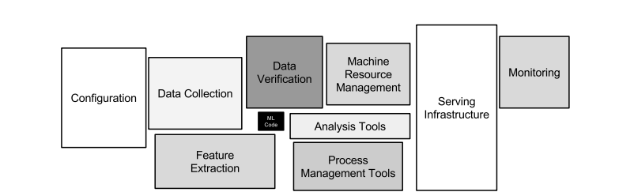
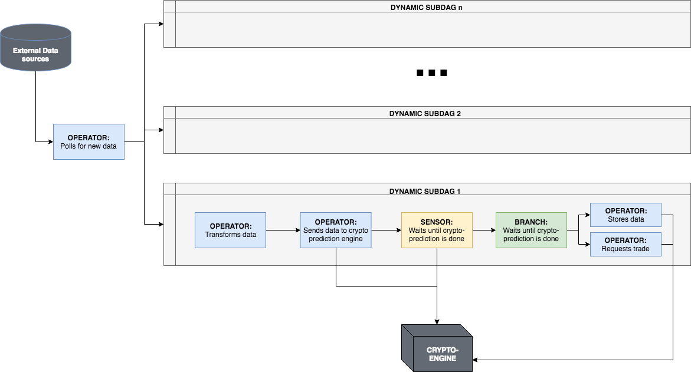

<!-- .slide: data-background="images/network-background.jpg" class="background" -->

<h2>Industrial Machine Learning</h2>
<h4>Horizontally Scalable ML Pipelines with Airflow</h4>
<p>
  <br />
  <br />
    Alejandro Saucedo <br/><br/>
    <a href="http://twitter.com/AxSaucedo">@AxSaucedo</a><br/>
    <a href="http://linkedin.com/in/AxSaucedo">in/axsaucedo</a><br/>
  <br />
</p>
<p>

[NEXT]
<!-- .slide: data-background="images/network-background.jpg" class="background" -->

<h2>Industrial Machine Learning</h2>

<h4>Horizontally Scalable ML Pipelines with Airflow</h4>

<table class="bio-table">
  <tr>
    <td style="float: left">
        <br>
        
        <br>
        <font style="font-weight: bold; color: white">Alejandro Saucedo</font>
        <br>
        <br>
    </td>
    <td style="float: left; color: white; font-size: 0.7em;">

        <br>
        Chief Scientist
        <br>
        <a style="color: cyan" href="http://e-x.io">The Institute for Ethical AI & ML</a
        <br>
        <br>
        <br>
        <hr>
        <br>
        Head of Solutions Eng. & Sci.
        <br>
        <a style="color: cyan" href="http://eigentech.com">Eigen Technologies</a>
        <br>
        <br>
        Chief Technology Officer
        <br>
        <a style="color: cyan" href="#">Hack Partners</a>
        <br>
        <br>
        Software Engineer
        <br>
        <a style="color: cyan" href="#">Bloomberg LP.</a>

    </td>
  </tr>
  <tr>
  </tr>
</table>


[NEXT]
<!-- .slide: data-state="flashing" data-background-iframe="http://ethical.institute" data-background-color="black" class="background smallquote" style="color: white" -->

<br>
<br>
<br>
<br>
<br>
<br>
<br>
<br>
<br>
<br>
## http://ethical.institute/

[NEXT]
<!-- .slide: data-background="images/partistat.png" class="background smallquote" style="color: white" -->

## A new complexity


## http://ethical.institute/

[NEXT]
<!-- .slide: data-background="images/partistat.png" class="background smallquote" style="color: white" -->

## Tackling the core


## http://ethical.institute/


[NEXT]
<!-- .slide: data-background="images/partistat.png" class="background smallquote" style="color: white" -->
## The core Principles


## http://ethical.institute/


[NEXT]
<!-- .slide: data-background="images/partistat.png" class="background smallquote" style="color: white" -->

## AI Procurement Framework

<div class="left-col">

</div>
<div class="right-col">
<ul>
    <br>
    <li>
        A set of tempaltes to support industry practitioners and suppliers in AI tenders. 
    </li>
    <br>
    <li>
        Fully open source, built using our "Machine Learning Maturity Model".
    </li>
</ul> 
</div>


    
[NEXT]
<!-- .slide: data-background="images/network-background.jpg" class="background smallquote" -->

## Today: Industry-ready ML

> Overview  & caveats in scaling data pipelines
> <br>
> <br>
> Airflow components (Celery, ML models, etc)
>
> Introducing difference between ML & Data Pipelines
>
> Overview of Airflow + Usecase

### The big picture


[NEXT]
<!-- .slide: data-background="images/network-background.jpg" class="background smallquote" -->

# Learning by example

> Today we are...

## Building a tech startup

[NEXT]
<!-- .slide: data-background="images/network-background.jpg" class="background smallquote" -->

# Crypto-ML Ltd.

> Let's jump the hype-train! 
> <br>
> <br>
> A large scale <font style="color: cyan">crypto-analysis</font> platform
>
> Heavy compute <font style="color: cyan">data analysis, Transform, Fetch...</font> 
>
> Going deep running <font style="color: cyan">predictions on LSTMs</font>
>

<br>
#### Can we survive the 2017 <font style="color: cyan">crypto-craze?</font>

[NEXT]
<!-- .slide: data-background="images/network-background.jpg" class="background smallquote" -->

# The Dataset

> All historical data from top 100 cryptos
>
> Data goes from beginning to 09/2017

> 563871 daily-price (close) points 


[NEXT]
<!-- .slide: data-background="images/network-background.jpg" class="background smallest" -->

## Interface: CryptoLoader

<pre><code class="code python hljs" style="font-size: 1em; line-height: 1em">
from crypto_ml.data_loader import CryptoLoader cl

loader = cl()

loader.get_prices("bitcoin")
> array([ 134.21,  144.54,  139.  , ..., 3905.95, 3631.04, 3630.7 ])


loader.get_df("bitcoin").head()
>            Date    Open    High     Low   Close     Market Cap
> 1608 2013-04-28  135.30  135.98  132.10  134.21  1,500,520,000
> 1607 2013-04-29  134.44  147.49  134.00  144.54  1,491,160,000
> 1606 2013-04-30  144.00  146.93  134.05  139.00  1,597,780,000
> 1605 2013-05-01  139.00  139.89  107.72  116.99  1,542,820,000
> 1604 2013-05-02  116.38  125.60   92.28  105.21  1,292,190,000

</code></pre>

<div class="clear-col"></div>


[NEXT]
<!-- .slide: data-background="images/network-background.jpg" class="background smallest" -->

## Interface: CryptoManager

<pre><code class="code python hljs" style="font-size: 1em; line-height: 1em">
from crypto_ml.manager import CryptoManager as cm

manager = cm()

manager.send_tasks()

> bitcoin [[4952.28323284 5492.85474648 6033.42626011 6573.99777374 7114.56928738
> 7655.14080101 8195.71231465 8736.28382828 9276.85534192 9817.42685555]]
> bitconnect [[157.70136155 181.86603134 206.03070113 230.19537092 254.36004071
> 278.5247105  302.6893803  326.85405009 351.01871988 375.18338967]]

</code></pre>

<div class="clear-col"></div>

<!-- .element style="color: white;" -->

[NEXT]
<!-- .slide: data-background="images/network-background.jpg" class="background" -->
### Code
https://github.com/axsauze/crypto-ml

### Slides
http://github.com/axsauze/industrial-airflow


[NEXT]
## #LetsDoThis

[NEXT SECTION]
# 1. The Early Crypto-Beginnings

[NEXT]

### JUNE 2017

Crypto-ML Ltd. builds an incredibly accurate model

<pre><code class="code python hljs" style="font-size: 1em; line-height: 1em">
import random, time

def predict_crypto(self, crypto_data):

    # pretend to do something
    time.sleep(10)

    return crypto_data * random.uniform(1, 2)

</code></pre>

### Which resulted on £100m in VC money

[NEXT]

They found the perfect dataset

<pre><code class="code python hljs" style="font-size: 1em; line-height: 1em">
from crypto_ml.data_loader import CryptoLoader

btc = CryptoLoader().get_df("bitcoin")

btc.head()

>            Date    Open    High     Low   Close     Market Cap
> 1608 2013-04-28  135.30  135.98  132.10  134.21  1,500,520,000
> 1607 2013-04-29  134.44  147.49  134.00  144.54  1,491,160,000
> 1606 2013-04-30  144.00  146.93  134.05  139.00  1,597,780,000
> 1605 2013-05-01  139.00  139.89  107.72  116.99  1,542,820,000
> 1604 2013-05-02  116.38  125.60   92.28  105.21  1,292,190,000


</code></pre>

but they had no idea what to do


[NEXT]
The Crypto-ML team realised copy pasting code from 

### Stack overflow

wasn't enough...


[NEXT]

They had to do it properly

they learned how to build their

## Machine Learning Pipeline

[NEXT]
<!-- .slide: data-transition="slide-in fade-out" -->
## They found it breaks into


**Model training/creation** and then **prediction with model**

[NEXT]
<!-- .slide: data-transition="fade-in fade-out" -->
1) Machine learning model development


[NEXT]
<!-- .slide: data-transition="fade-in slide-out" -->
And then, using our model to predict unseen inputs


[NEXT]
<!-- .slide: data-transition="fade-in slide-out" -->

### CryptoML learned the hard way


### More layers != better performance


[NEXT]
<!-- .slide: data-transition="fade-in slide-out" -->
### Following best practices does


* Analysing dataset representability, class imbalance, etc
* Focusing in feature engineering and analysis
* Using the right model for the right challenge
* Taking a pragmatic approach on accuracy

[NEXT]
<!-- .slide: data-transition="slide-in fade-out" -->
### The CryptoML Team felt ready 
## to build their DL pipeline


[NEXT]
<!-- .slide: data-transition="slide-in fade-out" -->

### LSTM Training Model

<pre><code class="code python hljs" style="font-size: 0.8em; line-height: 1em">

def train_lstm_model(prices):

    x, y = build_lstm_data(prices, WINDOW_SIZE, training=True)
   
    model = get_rnn_model()

    model.fit(x, y, batch_size=512, nb_epoch=1, validation_split=0.05)

    model.save("latest_model.h5")

</code></pre>

[NEXT]
<!-- .slide: data-transition="fade-in fade-out" -->

### LSTM Training Model

<pre><code class="code python hljs" style="font-size: 0.8em; line-height: 1em">

def train_lstm_model(prices):

    # <- Clean and transform data
    x, y = build_lstm_data(prices, WINDOW_SIZE, training=True)
   
    model = get_rnn_model()

    model.fit(x, y, batch_size=512, nb_epoch=1, validation_split=0.05)

    model.save("latest_model.h5")

</code></pre>


[NEXT]
<!-- .slide: data-transition="fade-in fade-out" -->

### LSTM Training Model

<pre><code class="code python hljs" style="font-size: 0.8em; line-height: 1em">

def train_lstm_model(prices):

    # <- Clean and transform data
    x, y = build_lstm_data(prices, WINDOW_SIZE, training=True)
   
    # <- Select your model
    model = get_rnn_model()

    model.fit(x, y, batch_size=512, nb_epoch=1, validation_split=0.05)

    model.save("latest_model.h5")

</code></pre>


[NEXT]
<!-- .slide: data-transition="fade-in fade-out" -->

### LSTM Training Model

<pre><code class="code python hljs" style="font-size: 0.8em; line-height: 1em">

def train_lstm_model(prices):

    # <- Clean and transform data
    x, y = build_lstm_data(prices, WINDOW_SIZE, training=True)
   
    # <- Select your model
    model = get_rnn_model()

    # <- Train your model
    model.fit(x, y, batch_size=512, nb_epoch=1, validation_split=0.05)

    model.save("latest_model.h5")

</code></pre>

[NEXT]
<!-- .slide: data-transition="fade-in slide-out" -->

### LSTM Training Model

<pre><code class="code python hljs" style="font-size: 0.8em; line-height: 1em">

def train_lstm_model(prices):

    # <- Clean and transform data
    x, y = build_lstm_data(prices, WINDOW_SIZE, training=True)
   
    # <- Select your model
    model = get_rnn_model()

    # <- Train your model
    model.fit(x, y, batch_size=512, nb_epoch=1, validation_split=0.05)

    # <- Persist your model
    model.save("latest_model.h5")

</code></pre>


[NEXT]
<!-- .slide: data-transition="slide-in fade-out" -->
### LSTM Trained Model Inference

<pre><code class="code python hljs" style="font-size: 0.8em; line-height: 1em">

def deep_predict(prices):

    x = build_lstm_data(prices, WINDOW_SIZE, training=False)

    model = load_model("latest_model.h5")

    return model.predict(x)

</code></pre>


[NEXT]
<!-- .slide: data-transition="fade-in fade-out" -->
### LSTM Trained Model Inference

<pre><code class="code python hljs" style="font-size: 0.8em; line-height: 1em">

def deep_predict(prices):

    # <- Transform data
    x = build_lstm_data(prices, WINDOW_SIZE, training=False)

    model = load_model("latest_model.h5")

    return model.predict(x)

</code></pre>


[NEXT]
<!-- .slide: data-transition="fade-in fade-out" -->
### LSTM Trained Model Inference

<pre><code class="code python hljs" style="font-size: 0.8em; line-height: 1em">

def deep_predict(prices):

    # <- Transform data
    x = build_lstm_data(prices, WINDOW_SIZE, training=False)

    # <- Load model
    model = load_model("latest_model.h5")

    return model.predict(x)

</code></pre>


[NEXT]
<!-- .slide: data-transition="fade-in slide-out" -->
### LSTM Trained Model Inference

<pre><code class="code python hljs" style="font-size: 0.8em; line-height: 1em">

def deep_predict(prices):

    # <- Transform data
    x = build_lstm_data(prices, WINDOW_SIZE, training=False)

    # <- Load model
    model = load_model("latest_model.h5")

    # <- Predict using your model
    return model.predict(x)

</code></pre>


[NEXT]
# It works!

<pre><code class="code python hljs" style="font-size: 1em; line-height: 1em">
from crypto_ml.data_loader import CryptoLoader


cl = CryptoLoader()
df = cl.get_df("bitcoin")

prices = df[["Price"]].values

# Train model
train_lstm_model(prices)

# Predict using trained model
result = deep_predict(prices)

</code></pre>

[NEXT]
### Production you say?

[NEXT]

<div class="left-col">

</div>

<div class="right-col">

<br>
<br>
<h1>Sure!</h1>
</div>

<br style="clear: both">

## Good old crontab
#### It's never failed anyone in production


[NEXT SECTION]

# 2. Going distributed 

[NEXT]

## September 2017

After CryptoML was caught using deep learning...

...they were featured in the top 10 global news

[NEXT]

## Their userbase exploded

They had a massive increase in their user-base

Users are running too many requests that can't be handled

[NEXT]
### It's time to go distributed

[NEXT]
# Introducing Celery


* Distributed
* Asynchronous
* Task Queue
* For Python

[NEXT]
### Producer-consumer Architecture


The Crypto-ML Devs thought go distributed was too hard

**It's not with celery.**


[NEXT]
<!-- .slide: data-transition="slide-in fade-out" -->
## Consumer - Step 1: Choose code

<pre><code class="code python hljs" style="font-size: 0.8em; line-height: 1em">
def deep_predict(prices):

    x = build_lstm_data(prices, WINDOW_SIZE, training=False)

    model = load_model("latest_model.h5")

    return model.predict(x)

</code></pre>

[NEXT]
<!-- .slide: data-transition="fade-in fade-out" -->
## Consumer - Step 2: Celerize it

<pre><code class="code python hljs" style="font-size: 0.8em; line-height: 1em; ">
app = Celery('crypto_ml')

@app.task
def deep_predict(d_prices):

    prices = load(prices)

    x = build_lstm_data(prices, WINDOW_SIZE, training=False)

    model = load_model("latest_model.h5")

    return dump(model.predict(prices))

</code></pre>

[NEXT]
<!-- .slide: data-transition="fade-in fade-out" -->
## Consumer - Step 2: Celerize it

<pre><code class="code python hljs" style="font-size: 0.8em; line-height: 1em; ">
# <- Initialise celery with id
app = Celery('crypto_ml')

@app.task
def deep_predict(d_prices):

    prices = load(prices)

    x = build_lstm_data(prices, WINDOW_SIZE, training=False)

    model = load_model("latest_model.h5")

    return dump(model.predict(prices))

</code></pre>


[NEXT]
<!-- .slide: data-transition="fade-in fade-out" -->
## Consumer - Step 2: Celerize it

<pre><code class="code python hljs" style="font-size: 0.8em; line-height: 1em; ">
# <- Initialise celery with id
app = Celery('crypto_ml')

# <- Convert function into distributed
@app.task
def deep_predict(d_prices):

    prices = load(prices)

    x = build_lstm_data(prices, WINDOW_SIZE, training=False)

    model = load_model("latest_model.h5")

    return dump(model.predict(prices))

</code></pre>

[NEXT]
<!-- .slide: data-transition="fade-in fade-out" -->
## Consumer - Step 2: Celerize it

<pre><code class="code python hljs" style="font-size: 0.8em; line-height: 1em; ">
# <- Initialise celery with id
app = Celery('crypto_ml')

# <- Convert function into distributed
@app.task
def deep_predict(d_prices):

    # <- De-serialise input from queue
    prices = load(prices)

    x = build_lstm_data(prices, WINDOW_SIZE, training=False)

    model = load_model("latest_model.h5")

    return dump(model.predict(prices))

</code></pre>


[NEXT]
<!-- .slide: data-transition="fade-in slide-out" -->
## Consumer - Step 2: Celerize it

<pre><code class="code python hljs" style="font-size: 0.8em; line-height: 1em; ">
# <- Initialise celery with id
app = Celery('crypto_ml')

# <- Convert function into distributed
@app.task
def deep_predict(d_prices):

    # <- De-serialise input from queue
    prices = load(prices)

    x = build_lstm_data(prices, WINDOW_SIZE, training=False)

    model = load_model("latest_model.h5")

    # <- Serialise output to return to queue
    return dump(model.predict(prices))

</code></pre>


[NEXT]
## Consumer - Step 3: Run it!

<pre><code class="code bash hljs" style="font-size: 0.8em; line-height: 1em; ">
$ celery -A crypto_ml worker

Darwin-15.6.0-x86_64-i386-64bit 2018-03-10 00:43:28

[config]
.> app:         crypto_ml:0x10e81a9e8
.> transport:   amqp://user:**@localhost:5672//
.> results:     amqp://
.> concurrency: 8 (prefork)
.> task events: OFF (enable -E to monitor tasks in this worker)

[queues]
.> celery           exchange=celery(direct) key=celery

</code></pre>


[NEXT]

## We're already halfway there

Now we just need to make the producer!

<br>
**Pretty much just calling the function**

[NEXT]
<!-- .slide: data-transition="slide-in fade-out" -->
## Producer - Normal function

<pre><code class="code python hljs" style="font-size: 0.8em; line-height: 1em; ">

prices = cl.get_prices("bitcoin")

result = deep_predict(prices)

print(result)


</code></pre>


[NEXT]
<!-- .slide: data-transition="fade-in fade-out" -->
## Producer - Celerised function

<pre><code class="code python hljs" style="font-size: 0.8em; line-height: 1em; ">
prices = cl.get_prices("bitcoin")

d_prices = dump(prices)

task = deep_predict.delay(d_prices)

p_result = task.get()

result = load(p_result)

print(result)

</code></pre>


[NEXT]
<!-- .slide: data-transition="fade-in fade-out" -->
## Producer - Celerised function

<pre><code class="code python hljs" style="font-size: 0.8em; line-height: 1em; ">
prices = cl.get_prices("bitcoin")

# <- Serialise inputs
d_prices = dump(prices)

task = deep_predict.delay(d_prices)

p_result = task.get()

result = load(p_result)

print(result)

</code></pre>


[NEXT]
<!-- .slide: data-transition="fade-in fade-out" -->
## Producer - Celerised function

<pre><code class="code python hljs" style="font-size: 0.8em; line-height: 1em; ">
prices = cl.get_prices("bitcoin")

# <- Serialise inputs
d_prices = dump(prices)

# <- Call function through distributed worker
task = deep_predict.delay(d_prices)

p_result = task.get()

result = load(p_result)

print(result)

</code></pre>


[NEXT]
<!-- .slide: data-transition="fade-in fade-out" -->
## Producer - Celerised function

<pre><code class="code python hljs" style="font-size: 0.8em; line-height: 1em; ">
prices = cl.get_prices("bitcoin")

# <- Serialise inputs
d_prices = dump(prices)

# <- Call function through distributed worker
task = deep_predict.delay(d_prices)

# <- Wait for task to finish
p_result = task.get()

result = load(p_result)

print(result)

</code></pre>


[NEXT]
<!-- .slide: data-transition="fade-in slide-out" -->
## Producer - Celerised function

<pre><code class="code python hljs" style="font-size: 0.8em; line-height: 1em; ">
prices = cl.get_prices("bitcoin")

# <- Serialise inputs
d_prices = dump(prices)

# <- Call function through distributed worker
task = deep_predict.delay(d_prices)

# <- Wait for task to finish
p_result = task.get()

# <- De-serialise result
result = load(p_result)

print(result)

</code></pre>


[NEXT]
## When we run producer

It adds the task to the queue

And it's picked up by a worker


[NEXT]

# Visualise it

You can visualise through Celery "Flower"

``` bash
$ celery -A crypto_ml flower
> INFO: flower.command: Visit me at http://localhost:5555
```


[NEXT]
### Run more producers and consumers!


You can run them across multiple servers and grow horizontally very easily


[NEXT]
# Distriuted #Win

We now have ML, and are distributed.

We have surely won.

### Not really - getting there


[NEXT SECTION]

# 3. Smart Data Pipelines

[NEXT]

# December 2017

<div class="left-col">

</div>
<div class="right-col">

</div>

[NEXT]
The Crypto-ML has now an 
### exponentially increasing 
amount of 
## internal/external use-cases

Their data pipeline is getting unmanagable!

[NEXT]

## They also realised ML is the tip of the iceberg


People forget only a small fraction of real-world machine learning is composed of actual ML code

[NEXT]
## Growing data flow complexity

* There is a growing need to pull data from different sources
* There is a growing need to pre- and post-process data
* As complexity increases tasks depending on others
* If a task fails we wouldn't want to run the children tasks
* Some tasks need to be triggered chronologically
* Data pipelines can get quite complex 
* Having just celerized tasks ran by Linux chronjob gets messy
<br>
<br>


[NEXT]
#### Introducing 
# Airflow


The swiss army knife of data pipelines


[NEXT]
# What Airflow is NOT

[NEXT]
# What Airflow is NOT
## ❌ Airflow is far from perfect 

...but the best out there

[NEXT]
# What Airflow is NOT
## ❌ It's not a Lambda/FaaS framework

...although it could be programmed to be

[NEXT]
# What Airflow is NOT
## ❌ Is not extremely mature 

...hence it's in Apache "Incubation"

[NEXT]
# What Airflow is NOT
## ❌ It's not fully stable

...version 2.0 is being developed

[NEXT]
# What Airflow is NOT
## ❌ Airflow is not a data streaming solution 

...you could augment with STORM / Spark Streaming

[NEXT]

## Let's now dive into Airflow

[NEXT]
<!-- .slide: data-transition="fade-in fade-out" data-background="images/partistat.png" class="smallquote" style="color: black !important" -->
# Airflow in brief
* A data pipeline framework 
* Written in Python 
* It has an active community
* Provides a UI for management

[NEXT]
## DAGs are Airflow's core


## DAG = Directed Acyclic Graphs

These are ETL operations that are executed in order
and only execute if the previous ones are succesful

[NEXT]

### DAGs are defined programatically

These contain the execution order for operators

``` python
# Define DAG
DAG = DAG(dag_id="test",    
            start_date=datetime.now(), 
            schedule_interval="@once")

# Define operators
operator_1 = ...
operator_2 = ...
operator_3 = ...

# Define order
operator_1 >> operator_2 >> operator_3
```

As well as the schedule for execution


[NEXT]
## DAGs overview in list screen
View all DAGs, together with the schedule of execution


As well as the recent status of executed DAGs


[NEXT]
## Detailed DAG View


[NEXT]

## Operators are easy to define

<pre><code class="code python hljs" style="font-size: 1em; line-height: 1em; ">
# Create python functions
DAG = ...

def crypto_prediction():
    data = ... # gather some data
    prediction = ... # run some prediction
    db.store(prediction) # store prediction

# Define Operators
crypto_task = PythonOperator(
    task_id='pull_task',
    python_callable=crypto_prediction, # <- Add python function
    dag=DAG)

</code></pre>

Here is an example of a PythonOperator


[NEXT]

## Airflow provides default operators


You can use things like BranchOperator, SensorOperator, etc


[NEXT]

## Passing Data downstream

We can pass data across operators downstream with xcom

<pre><code class="code python hljs" style="font-size: 0.8em; line-height: 1em; ">
# Create python functions
def push_function():
    return ['a', 'b', 'c']

def pull_function(**kwargs):
    params = kwargs['ti'].xcom_pull(task_ids='push_task')
    print(params)

# Define Operators
pull_task = PythonOperator(
    task_id='pull_task',
    python_callable=pull_function,
    provide_context=True, # <- we pass the context
    dag=DAG)

push_task = PythonOperator(
    task_id='push_task',
    python_callable=push_function,
    provide_context=True, # <- again we pass the context
    dag=DAG)

# DAG order definition
push_task >> pull_task

</code></pre>

This is useful to hold state data, such as a DB index IDs

[NEXT]

## Visualise downstream params


You can see XCom parameters for each operator run


[NEXT]
## Airflow is modular

Modular separation of code, operators, dags, subdags, etc


<!-- .element: style="width: 70%" -->

This allows for better testing and re-usability

[NEXT]
## Airflow is extensible 

Airflow also allows you to write your own custom "plugins"

<pre><code class="code python hljs" style="font-size: 0.8em; line-height: 1em; ">
from util import load, dump
class AirflowPlugin(object):
    # The name of your plugin (str)
    name = None
    # A list of class(es) derived from BaseOperator
    operators = []
    # A list of class(es) derived from BaseHook
    hooks = []
    # A list of class(es) derived from BaseExecutor
    executors = []
    # A list of references to inject into the macros namespace
    macros = []
    # A list of objects created from a class derived
    # from flask_admin.BaseView
    admin_views = []
    # A list of Blueprint object created from flask.Blueprint
    flask_blueprints = []
    # A list of menu links (flask_admin.base.MenuLink)
    menu_links = []

</code></pre>

It's possible to write your own Operators, hooks, etc

[NEXT]
If that's not awesome enough...

[NEXT]
It uses celery as task runner


As well as ability to use different backends


[NEXT]
## The Crypto-ML Usecase

Crypto-ML wants a workflow where:

* They pull crypto-data every day
* Data is transformed & standardised
* Once ready, a prediction should be computed
* Prediction should be stored in DB
* If relevant, a trade should be executed

[NEXT]

Let's break this down into Airflow terminology

[NEXT]
## Sub-DAG for each crypto


[NEXT]
## DAG for all daily crypto job




[NEXT]
## The Crypto-ML Usecase

Scheduled task:
* Operator: polls new Crypto-data + triggers each sub-dags

Sub-DAG:
* Operator: Transforms the data
* Operator: Sends data to the crypto-prediction engine
* Sensor: Polls until the prediction is finished
* Branch: Modifies data & based on rules triggers action
    * Operator: Stores data in database
    * Operator: Sends request to trade


[NEXT]
Success!


[NEXT]
# Go check it out!

## [airflow.apache.org](https://airflow.apache.org/)


[NEXT]

## Airflow Alternatives
* Luigi
* Pinball
* Seldon Core

<br>
## Other similar (but different)
* Dask
* Apache Kafka

[NEXT]

### Special Mentions
* Docker
* Kubernetes

<br>
#### Implementations are in the codebase


[NEXT]
### What's next for Crypto-ML?

As with every other tech startup

the roller-coaster keeps going!


[NEXT SECTION]
<!-- .slide: data-background="images/network-background.jpg" class="background smallest" -->

### But for us?

> Got an overview in scaling data pipelines
> <br>
> <br>
> Airflow components (Celery, ML, etc)
>
> Difference between ML & Data Pipelines
>
> Overview of Airflow + Usecase

### The big picture


[NEXT]
<!-- .slide: data-background="images/network-background.jpg" class="background" -->
### Code
https://github.com/axsauze/crypto-ml

### Slides
http://github.com/axsauze/industrial-airflow

[NEXT]
<!-- .slide: data-background="images/network-background.jpg" class="background" -->

<h2>Industrial Machine Learning</h2>

<table class="bio-table">
  <tr>
    <td style="float: left">
        
        <br>
        <font style="font-weight: bold; color: white">Alejandro Saucedo</font>
        <br>
        <br>
    </td>
    <td style="float: left; color: white; font-size: 0.7em;">

        <br>
        Chief Scientist
        <br>
        <a style="color: cyan" href="http://e-x.io">The Institute for Ethical AI & ML</a>
        <br>
        <br>
        Fellow (AI, Data & ML)
        <br>
        <a style="color: cyan" href="#">The RSA</a>
        <br>
        <br>
        Advisor
        <br>
        <a style="color: cyan" href="http://teensinai.com">TeensInAI.com initiative</a>
        <br>

    </td>
  </tr>
  <tr>
  </tr>
</table>

### <a style="color: cyan" href="#">Contact me at: a@e-x.io</a>


