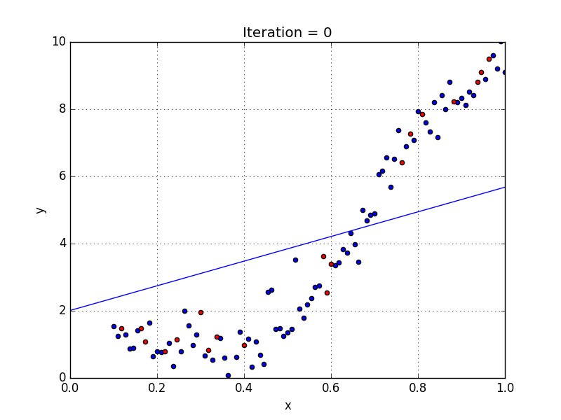
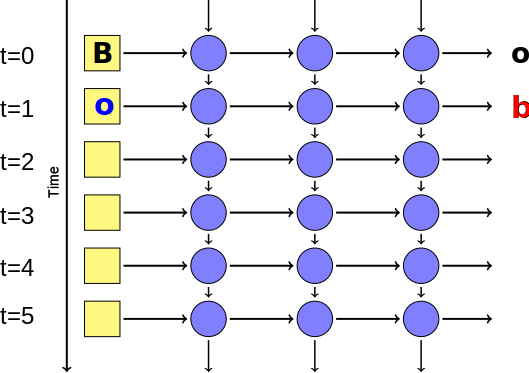
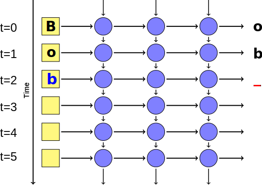
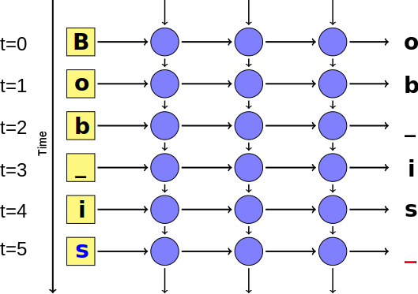

<!-- .slide: data-background="images/network-background.jpg" class="background" -->

<h2>Industrial Machine Learning</h2>
<h4>Horizontally scalable Machine Learning in Python</h4>
<p>
  <br />
  <br />
    Alejandro Saucedo <br/><br/>
    <a href="http://twitter.com/AxSaucedo">@AxSaucedo</a><br/>
    <a href="http://linkedin.com/in/AxSaucedo">in/axsaucedo</a><br/>
  <br />
</p>
<p>

[NEXT]
<!-- .slide: data-background="images/network-background.jpg" class="background" -->

<h2>Industrial Machine Learning</h2>

<h4>Horizontally scalable Machine Learning in Python</h4>

<table class="bio-table">
  <tr>
    <td style="float: left">
        
        <br>
        <font style="font-weight: bold; color: white">Alejandro Saucedo</font>
        <br>
        <br>
    </td>
    <td style="float: left; color: white; font-size: 0.7em;">

        <br>
        Head of Deployed Engineering
        <br>
        <a style="color: cyan" href="#">Eigen Technologies</a>
        <br>
        <br>
        Chief Technology Officer
        <br>
        <a style="color: cyan" href="#">Exponential</a>
        <br>
        <br>
        Chairman
        <br>
        <a style="color: cyan" href="#">The Institute for Ethical AI & ML</a>
        <br>
        <br>
        Fellow (AI, Data & ML)
        <br>
        <a style="color: cyan" href="#">The RSA</a>
        <br>

    </td>
  </tr>
  <tr>
  </tr>
</table>

    
[NEXT]
<!-- .slide: data-background="images/network-background.jpg" class="background smallquote" -->

# Industry-ready ML

> An intuitive overview on general ML
> <br>
> <br>
> A set of simple ML and heavier DL models
>
> A distributed ML architecture
>
> An elastically scalable setup

### The big picture


[NEXT]
<!-- .slide: data-background="images/network-background.jpg" class="background smallquote" -->

# Learning by example

> Today we are...

## Building a tech startup

[NEXT]
<!-- .slide: data-background="images/network-background.jpg" class="background smallquote" -->

# Crypto-ML Ltd.

> Let's jump the hype-train! 
> <br>
> <br>
> A ML framework for <font style="color: cyan">crypto-data</font>
>
> Supporting <font style="color: cyan">heavy compute/memory ML</font>
>
> Can our system survive the <font style="color: cyan">crypto-craze?</font>


[NEXT]
<!-- .slide: data-background="images/network-background.jpg" class="background smallquote" -->

# The Dataset

> All historical data from top 100 cryptos
>
> Data goes from beginning to 11/2017

> 563871 daily-price (close) points 
>
> <font style="font-weight: bold; color: cyan">Objectives:</font>
<font style="color: white">
* Supporting heavy ML computations
* Supporting increasing traffic 

</font>


[NEXT]
<!-- .slide: data-background="images/network-background.jpg" class="background smallest" -->

## Interface: CryptoLoader

<pre><code class="code python hljs" style="font-size: 1em; line-height: 1em">
from crypto_ml.data_loader import CryptoLoader cl

loader = cl()

loader.get_prices("bitcoin")
> array([ 134.21,  144.54,  139.  , ..., 3905.95, 3631.04, 3630.7 ])


loader.get_df("bitcoin").head()
>            Date    Open    High     Low   Close     Market Cap
> 1608 2013-04-28  135.30  135.98  132.10  134.21  1,500,520,000
> 1607 2013-04-29  134.44  147.49  134.00  144.54  1,491,160,000
> 1606 2013-04-30  144.00  146.93  134.05  139.00  1,597,780,000
> 1605 2013-05-01  139.00  139.89  107.72  116.99  1,542,820,000
> 1604 2013-05-02  116.38  125.60   92.28  105.21  1,292,190,000

</code></pre>

<div class="clear-col"></div>


[NEXT]
<!-- .slide: data-background="images/network-background.jpg" class="background smallest" -->

## Interface: CryptoManager

<pre><code class="code python hljs" style="font-size: 1em; line-height: 1em">
from crypto_ml.manager import CryptoManager as cm

manager = cm()

manager.send_tasks()

> bitcoin [[4952.28323284 5492.85474648 6033.42626011 6573.99777374 7114.56928738
> 7655.14080101 8195.71231465 8736.28382828 9276.85534192 9817.42685555]]
> bitconnect [[157.70136155 181.86603134 206.03070113 230.19537092 254.36004071
> 278.5247105  302.6893803  326.85405009 351.01871988 375.18338967]]

</code></pre>

<div class="clear-col"></div>

<!-- .element style="color: white;" -->


[NEXT]
<!-- .slide: data-background="images/network-background.jpg" class="background" -->
### Code
https://github.com/axsauze/crypto-ml

### Slides
http://github.com/axsauze/industrial-machine-learning


[NEXT]
## #LetsDoThis

[NEXT SECTION]
# 1. Machine Learning Intuition

[NEXT]

Crypto-ML Ltd. managed to appear in top tech magazines and raise VC money with their initial prototype.

<pre><code class="code python hljs" style="font-size: 1em; line-height: 1em">
import random

def predict_crypto(self, crypto_data):
    # I have no clue what I'm doing
    return crypto_data * random.uniform(0, 1)

</code></pre>

<br>

### Now they need to figure out what ML is


[NEXT]

### ML Tutorials Everywhere


[NEXT]
Given some input data, predict the correct output


Let's try to predict whether a shape is a square or a triangle

### How do we do this?

[NEXT]
## Let's visualise it

* Imagine a 2-d plot
* The x-axis is the area of the input shape
* The y-axis is the perimeter of the input shape


[NEXT]
## All about the function

<div class="left-col">
**$f(x̄) = mx̄ + b$**, where:
<br>
<br>
**x̄** is input (area & perimeter) </li>
<br>
<br>
**m** and **b** are weights/bias
<br>
</div>


The result **$f(x̄)$** states whether it's a triangle or square
<br>
<br>
(i.e. if it's larger than 0.5 it's triangle otherwise square)

[NEXT]
### We let the machine do the learning


[NEXT]
### We let the machine do the learning


[NEXT]
### We let the machine do the learning


[NEXT]
### Minimising loss function

We optimise the model by **minimising its loss**.

Keep adjusting the weights...

...until loss is not getting any smaller.


[NEXT]
### Finding the weights!


When it finishes, we find optimised weights and biases

i.e. **$f(x̄)$ = triangle  if ($0.3 x̄ + 10$) > 0.5 else square**

[NEXT]
### Now predict new data


Once we have our function, we can predict NEW data!


[NEXT]
### We're ML experts!

Please collect your certificates after the talk
<br>
<br>

These are valid in:

* Your Linkedin profile
* Non-tech Meetups and Parties
* Any time you reply to a tweet

[NEXT]

### In all seriousness...

`f(x) = mx + b`  

is the single perceptron function

in a neural network
<br>


[NEXT]
### Instead of just one neuron


[NEXT]
### We just have many


This gives the function more flexibility


[NEXT]
### With a few layers


This gives more flexibility for learning


[NEXT]
But what about with more complex cases?


[NEXT]

### Deep Neural Networks 


[NEXT]
### Deep Networks &mdash; many hidden layers


[NEXT]


[NEXT]


[NEXT]


[NEXT]


[NEXT SECTION]
# 2. Machine Learning in Practice


[NEXT]
The real world has more varied and complex cases

You need a pragmatic approach

<div class="right-col">

</div>

<br>
<div class="left-col">
<ul>
<li> Extending our feature space</li>
<li> Increasing number of inputs</li>
<li> Regularisation techniques (dropout, batch normalisation)</li>
<li> Normalising datasets</li>
</ul>

</div>


[NEXT]
The Crypto-ML devs asked themselves...

<pre><code class="code python hljs" style="font-size: 1em; line-height: 1em">
from crypto_ml.data_loader import CryptoLoader

btc = CryptoLoader().get_df("bitcoin")

btc.head()

>            Date    Open    High     Low   Close     Market Cap
> 1608 2013-04-28  135.30  135.98  132.10  134.21  1,500,520,000
> 1607 2013-04-29  134.44  147.49  134.00  144.54  1,491,160,000
> 1606 2013-04-30  144.00  146.93  134.05  139.00  1,597,780,000
> 1605 2013-05-01  139.00  139.89  107.72  116.99  1,542,820,000
> 1604 2013-05-02  116.38  125.60   92.28  105.21  1,292,190,000


</code></pre>

We are now experts in ML, however...

...can this be used for our cryptocurrency price data?

[NEXT]
# Not yet.

Processing sequential data requires a different approach.
<br>
<br>

Instead of trying to predict two classes...

...we want to predict future steps
<br>
<br>

#### How do we do this?

[NEXT]

# Sequential Models

Sequential models often are used to predict future data.

<div class="left-col">

</div>

<div class="right-col">
Still uses the same approach
<br>

`f(x) = mx + b`  
<br>
To find the weights and biases
<br>
<br>

But can be used on time-sequence data - ie. prices, words, characters, etc.
</div>


[NEXT]

## The hello_world of ML

Predicting prices by fitting a line on set of time-series points


### Linear Regression


[NEXT]

# Linear Regression

<pre><code class="code python hljs" style="font-size: 1em; line-height: 1em">
from sklearn import linear_model


def predict(prices, times, predict=10):

    model = linear_model.LinearRegression()

    model.fit(times, prices)

    predict_times = get_prediction_timeline(times, predict)

    return model.predict(predict_times)

</code></pre>

[NEXT]
# Linear Regression

<pre><code class="code python hljs" style="font-size: 1em; line-height: 1em">
from crypto_ml.data_loader import CryptoLoader


cl = CryptoLoader()

df = cl.get_df("bitcoin")

times = df[["Date"]].values
prices = df[["Price"]].values

results = predict(prices, times, 5)

</code></pre>

### Success

[NEXT]
### But the Crypto-ML team wants 
#cutting edge tech

[NEXT]

# Deep Recurrent 
# Neural Networks 

[NEXT]

### Deep Recurrent Neural Networks
They are pretty much deep neural networks.
<br>
<br>

But their use is to predict a future time-step...

...instead of predicting a class.


[NEXT]
### Deep Recurrent Neural Networks

Because of the layers and neurons:

* They can hold more complex functions/models.

* They can take more complex features.

* They require more data

[NEXT]
### Let's recall deep neural nets


[NEXT]
### Simplified Visualisation

One node represents a full layer of neurons.

[NEXT]
### Simplified Visualisation


One node represents a full layer of neurons.


[NEXT]
### Unrolled Recurrent Network
Previous predictions help make the _next_ prediction.

Each prediction is a **time step**.


[NEXT]
### Recurrent Networks


Hidden layer's input includes the output of itself during the last run of the
network.


[NEXT]


[NEXT]


[NEXT]


[NEXT]


[NEXT]


[NEXT]


[NEXT]


[NEXT]

### Loss/Cost function
Cost function is based on getting the prediction right!


[NEXT]
### Deep learning framework

We are building this example with Keras


<br>

#### There are many others to choose from


[NEXT]
### Training an RNN in Python

<pre><code class="code python hljs" style="font-size: 0.8em; line-height: 1em">

def deep_predict(prices):

    p = 10

    model = get_rnn_model()

    x, y = build_lstm_data(prices, 50)

    model.fit(x, y, batch_size=512, nb_epoch=1, validation_split=0.05)

    return rnn_predict(model, x, prices)

</code></pre>

* Build model
* Compute the weights
* Return the prediction


[NEXT]
### Not too different, eh!

<pre><code class="code python hljs" style="font-size: 0.8em; line-height: 1em">
from sklearn import linear_model


def predict(prices, times, predict=10):

    model = linear_model.LinearRegression()

    model.fit(times, prices)

    predict_times = get_prediction_timeline(times, predict)

    return model.predict(predict_times)

</code></pre>


<pre><code class="code python hljs" style="font-size: 0.8em; line-height: 1em">

def deep_predict(prices):

    p = 10

    model = get_rnn_model()

    x, y = build_lstm_data(prices, 50)

    model.fit(x, y, batch_size=512, nb_epoch=1, validation_split=0.05)

    return rnn_predict(model, x, prices)

</code></pre>


[NEXT]
### To build the LSTM

<pre><code class="code python hljs" style="font-size: 0.8em; line-height: 1em">
from keras.layers.core import Dense, Activation, Dropout
from keras.layers.recurrent import LSTM
from keras.models import Sequential
import lstm

def get_rnn_model():
    model = Sequential()
    model.add(LSTM(input_dim=1, output_dim=50, return_sequences=True))
    model.add(Dropout(0.2))

    model.add(LSTM(100, return_sequences=False))
    model.add(Dropout(0.2))

</code></pre>

In this case 50 recurrent layers that pass output to next layer...

...and 100 that don't pass output until end of sequence

(+ regulatisation)


[NEXT]
### Finishing the model

<pre><code class="code python hljs" style="font-size: 0.8em; line-height: 1em">
from keras.layers.core import Dense, Activation, Dropout
from keras.layers.recurrent import LSTM
from keras.models import Sequential
import lstm

def get_rnn_model():
    model = Sequential()
    model.add(LSTM(input_dim=1, output_dim=50, return_sequences=True))
    model.add(Dropout(0.2))

    model.add(LSTM(100, return_sequences=False))
    model.add(Dropout(0.2))

    model.add(Dense(output_dim=1))
    model.add(Activation('linear'))

    model.compile(loss="mse", optimizer="rmsprop")

    return model

</code></pre>

A linear dense layer to aggregate the data into a single value

Compile with mean sq. error & gradient descent as optimizer

Simple!


[NEXT]
# RNN Test-run

<pre><code class="code python hljs" style="font-size: 1em; line-height: 1em">
from crypto_ml.data_loader import CryptoLoader


cl = CryptoLoader()

df = cl.get_df("bitcoin")

times = df[["Date"]].values
prices = df[["Price"]].values

results = deep_predict(prices, times, 5)

</code></pre>


### Success

[NEXT]

# Side note

In this example we are training and predicting in the same function.

Normally you would train your model, and then run the model in "production" for predictions


[NEXT]

## Crypto-ML 
# has the DL!

Are we done then?

# Nope

The fun is just starting


[NEXT SECTION]

# 3. Distributed Architecture

[NEXT]

After CryptoML was caught using deep learning...

...they were featured in the top 10 global news

[NEXT]

## Their userbase exploded

Now they have quite a few users coming in every day 

Each user is running several ML algorithms concurrently

They tried getting larger and larger AWS servers

[NEXT]
## They should've seen this coming

* Machine learning is known for being computing heavy
* But often it's forgotten how memory-heavy it is
* I'm talking VERY heavy - holding whole models in-mem
* Scaling to bigger instances with more cores is expensive
* Having everything in one node is a central point of failure
* Data pipelines can get quite complex 

<br>
### It's time to go distributed

[NEXT]
### Producer-consumer Architecture


The Crypto-ML Devs thought go distributed was too hard

**It's not.**

[NEXT]
# Introducing Celery


* Distributed
* Asynchronous
* Task Queue
* For Python

[NEXT]
## Step 1: Choose a function

<pre><code class="code python hljs" style="font-size: 0.8em; line-height: 1em">

def deep_predict(prices, times, predict=10):

    model = utils.get_rnn_model()

    model.fit(time, prices, batch_size=512, nb_epoch=1, validation_split=0.05)

    predict_times = get_prediction_timeline(times, predict)

    return model.predict(predict_times)

</code></pre>

[NEXT]
## Step 2: Celerize it

<pre><code class="code python hljs" style="font-size: 0.8em; line-height: 1em; ">
from celery import Celery
from utils import load, dump

# Initialise celery with rabbitMQ address
app = Celery('crypto_ml',
    backend='amqp://guest@localhost/',    
    broker='amqp://guest@localhost/')

# Add decorator for task (can also be class)
@app.task
def deep_predict(d_prices, d_times, predict=10):

    # Load from stringified binaries (Pandas Dataframes)
    prices = load(d_prices)
    times = load(d_times)

    model = utils.get_rnn_model()

    model.fit(time, prices, batch_size=512, nb_epoch=1, validation_split=0.05)

    predict_times = get_prediction_timeline(times, predict)

    return dump(model.predict(predict_times))
</code></pre>

[NEXT]
## Step 4: Run it!

<pre><code class="code python hljs" style="font-size: 0.8em; line-height: 1em; ">from crypto_ml.models import deep_predict

<pre><code class="code bash hljs" style="font-size: 0.8em; line-height: 1em; ">
$ celery -A crypto_ml worker

</code></pre>

See the activity logs:

<pre><code class="code bash hljs" style="font-size: 0.8em; line-height: 1em; ">
$ celery -A crypto_ml worker
Darwin-15.6.0-x86_64-i386-64bit 2018-03-10 00:43:28

[config]
.> app:         crypto_ml:0x10e81a9e8
.> transport:   amqp://user:**@localhost:5672//
.> results:     amqp://
.> concurrency: 8 (prefork)
.> task events: OFF (enable -E to monitor tasks in this worker)

[queues]
.> celery           exchange=celery(direct) key=celery

</code></pre>


[NEXT]

## We're already halfway there

Now we just need to make the producer!

**We can just follow the same recipe**

[NEXT]

## Step 1: Take the code

<pre><code class="code python hljs" style="font-size: 0.8em; line-height: 1em; ">
cl = CryptoLoader()
results = {}

# Compute results
for name in cl.get_crypto_names():

    prices, times = cl.get_prices(name)

    result = deep_predict(prices, times)

    results[name] = result

# Print results
for k,v in results.items():
    print(k, v)


</code></pre>

[NEXT]
## Step 2: Celerize it

<pre><code class="code python hljs" style="font-size: 0.8em; line-height: 1em; ">from crypto_ml.data_loader import CryptoLoader
from util import load, dump

cl = CryptoLoader()
results = {}

# Send task for distributed computing
for name in cl.get_crypto_names():

    prices, times = cl.get_prices(name)

    task = deep_predict.delay(
                      dump(prices)
                    , dump(times))

    results[name] = task

# Wait for results and print
for k,v in results.items():
    p_result = v.get()

    if result:
        result = load(p_result)
        print(k, result)

</code></pre>


[NEXT]
## Step 3: Run it!

By just running the Python in a shell command!


[NEXT]

# Visualise it

You can visualise through Celery "Flower"

``` bash
$ celery -A crypto_ml flower
> INFO: flower.command: Visit me at http://localhost:5555
```


[NEXT]
# Distriuted #Win

We now have ML, and are distributed.

We have surely won.

### Not really 

Having a horizontal architecture is just the first step...

Now we have to take full advantage of it!


[NEXT SECTION]
# 4. Elastic DevOps Infrastructure


[NEXT]
The CryptoML team remembers the easy days...

...when they only had a few new users a day

Now they have much heavier traffic!

They are working with large organsations!

They are processing massive loads of ML requests!

<br>
### Their DevOps infrastructure 
# Can't keep up!

[NEXT]

### Underestimating DevOps complexity

* Complexity of staging and deploying ML models
* Backwards compatibility of feature-spaces/models
* Distributing load across infrastructure
* Idle resource time minimisation
* Node failure back-up strategies
* Testing of Machine Learning functionality
* Monitoring of ML ecosystem
* And the list goes on and on...


[NEXT]
## Did anyone say docker?


Package it. Ship it.


[NEXT]
## Gotta love the simplicity

```
from conda/miniconda3-centos7:latest

ADD . /crypto_ml/
WORKDIR /crypto_ml/

# Dependency for one of the ML predictors
RUN yum install mesa-libGL -y

# Install all the dependencies
RUN conda env create -f crypto_ml.yml
```

and...

```
docker -t crypto_ml .
```

it's done!


[NEXT]
## Can this be more awesome?
####Yes it can!

Packaging it up and installing through pip/conda.

```
from conda/miniconda3-centos7:latest
RUN conda install <YOUR_PACKAGE>
```
Nice and simple!

[NEXT]
### The obvious docker-compose
<pre><code class="code python hljs" style="font-size: 0.6em; line-height: 1em">version: '2'
services:
    manager:
        container_name: crypto_manager
        image: crypto_ml
        build: .
        links:
            - rabbitmq
        depends_on:
            - rabbitmq
        command: tail -f /dev/null
    worker:
        container_name: crypto_worker
        image: crypto_ml
        build: .
        links:
            - rabbitmq
        depends_on:
            - rabbitmq
        command: /usr/local/envs/crypto_ml/bin/celery -A crypto_ml worker --prefetch-multiplier 1 --max-tasks-per-child 1 -O fair
    rabbitmq:
        container_name: rabbitmq
        image: rabbitmq:3.6.0
        environment:
            - RABBITMQ_DEFAULT_USER=user
            - RABBITMQ_DEFAULT_PASS=1234
        ports:
            - 4369
            - 5672
            - 15672
</code></pre>

It all just works automagically!

```
docker-compose up --scale crypto_worker=4
```

[NEXT]
#### Taking it to the next level with
# Kubernetes


[NEXT]
#### All the YML


Creating all the services and controllers

```
kubectl create -f k8s/*
```

[NEXT]

# Kubernetes: Dev

#### Development
* Minikube
* Docker for Mac

[NEXT]

# Kubernetes: Prod
#### Enterprise
* Elastic Container Service for K8s (AWS)
* CoreOS Tectonic
* Red Hat OpenShift

[NEXT]
# Kubernetes: Tools
#### Many options
* CloudFormation (AWS)
* Terraform
* Kops

[NEXT]
#### Docker for Mac now supports it!


**Mini fist-pump**


[NEXT]
What's next for Crypto-ML?


As with every other tech startup

the roller-coaster keeps going!


[NEXT SECTION]
<!-- .slide: data-background="images/network-background.jpg" class="background smallest" -->

### But for us?

> Obtained an intuitive understanding on ML
> 
> Learned about caveats on practical ML
> 
> Obtained tips on building distributed architectures
> 
> Got an taste of elastic DevOps infrastructure


[NEXT]
<!-- .slide: data-background="images/network-background.jpg" class="background" -->
### Code
https://github.com/axsauze/crypto-ml

### Slides
http://github.com/axsauze/industrial-machine-learning

[NEXT]
<!-- .slide: data-background="images/network-background.jpg" class="background" -->

<h2>Industrial Machine Learning</h2>

<table class="bio-table">
  <tr>
    <td style="float: left">
        
        <br>
        <font style="font-weight: bold; color: white">Alejandro Saucedo</font>
        <br>
        <br>
    </td>
    <td style="float: left; color: white; font-size: 0.7em;">

        <br>
        Head of Deployed Engineering
        <br>
        <a style="color: cyan" href="#">Eigen Technologies</a>
        <br>
        <br>
        Chief Technology Officer
        <br>
        <a style="color: cyan" href="#">Exponential</a>
        <br>
        <br>
        Chairman
        <br>
        <a style="color: cyan" href="#">The Institute for Ethical AI & ML</a>
        <br>
        <br>
        Fellow (AI, Data & ML)
        <br>
        <a style="color: cyan" href="#">The RSA</a>
        <br>

    </td>
  </tr>
  <tr>
  </tr>
</table>

### <a style="color: cyan" href="#">Join me at #PyDays18</a>


