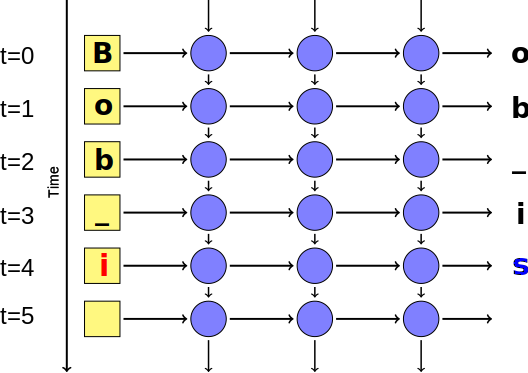
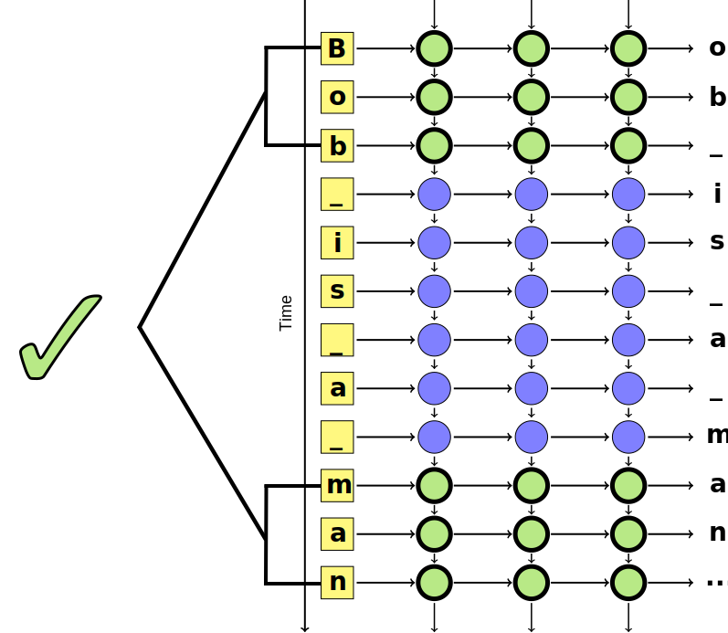

<!-- .slide: data-background="images/books_opened.jpg" class="background" -->

<h2>Deep Learning with Recurrent Neural Networks</h2>
<h4>Workshop In Python</h4>

[NEXT]
<!-- .slide: data-background="images/books_opened.jpg" class="background smallquote" -->

# Create an AI Author.

> Create a neural network that can write Shakespeare plays.
>
> Using 43 Shakespeare plays to train the network.

[NEXT]


_note_
1. merge all 30000 novels into a single text document
2. load single document as a flat sequence of characters
3. filter out characters we don't care about
4. map each char to an integer
  - integer decides which _input value_ is set to 0

**Result**: sequence of integers

_notes_
Emphasise the fact that you load all of the textual data in as integer-coded
chars. All documents are flattened into a single large sequence.

[NEXT]
Credit to Martin Gorner for collecting the Shakespere plays.


**Twitter: [@martin_gorner](https://twitter.com/martin_gorner)**


[NEXT SECTION]
## 1. Supervised Learning

Use labelled historical data to predict future outcomes

[NEXT]
Given some input data, predict the correct output


What **features** of the input tell us about the output?

[NEXT]
### Feature Space

* A feature is some property that describes raw input data
* Features represented as a vector in **feature space**
* **Abstract** complexity of raw input for easier processing


_note_
In this case, we have 2 features, so inputs are 2D vector that lie in
a 2D feature space.

[NEXT]
### Classification

<div class="left-col">
  <ul>
    <li>Training data is used to produce a model</li>
    <li>$f(x̄) = mx̄ + c$</li>
    <li>Model divides feature space into segments</li>
    <li>Each segment corresponds to one <strong>output class</strong></li>
  </ul>
</div>

<div class="right-col">
  
</div>

<div class="clear-col"></div>

[NEXT]
Use trained model to predict outcome of new, unseen data.

[NEXT]
### The Hard Part

Learning $m$ and $c$.


[NEXT SECTION]
## 2. Deep Recurrent Networks

### Recap

_note_
Source of following diagrams is:

http://www.hexahedria.com/2015/08/03/composing-music-with-recurrent-neural-networks/

[NEXT]
### The Mighty Perceptron

Synonymous to our linear function `f(x) = mx + c`

For `n` features, the perceptron is defined as:

[NEXT]
### The Mighty Perceptron

### `f(wx + b) = y`


[NEXT]
### Single neuron &mdash; one output


[NEXT]
### Neural network &mdash; multiple outputs


[NEXT]
### Deep Networks &mdash; many hidden layers


[NEXT]
### Simplified Visualisation


One node represents a full layer of neurons.

[NEXT]


[NEXT]
### Recurrent Networks


Hidden layer's input includes the output of itself during the last run of the
network.

[NEXT]
### Unrolled Recurrent Network
Previous predictions help make the _next_ prediction.

Each prediction is a **time step**.


[NEXT]


[NEXT]


[NEXT]


[NEXT]


[NEXT]


[NEXT]


[NEXT]


[NEXT]


[NEXT]


[NEXT]
### Problem: Long-Term Dependencies


[NEXT]
### Cell States

Add **extra state** to each layer of the network.

Remembers inputs **far into the past**.

Transforms layer's original output into something that is **relevant** to
the current context.

_note_
This extra state stores information on inputs from much earlier time steps.

The state transforms the hidden layer's original output into something that is
relevant to the current context, given what's happened in the past.

[NEXT]


[NEXT]


[NEXT]
Hidden layer output _and_ cell state is feed into next time step.

Gives network ability to handle long-term dependencies in sequences.

_note_
Feeding the output of a hidden layer _and_ its internal cell state back into
itself at the next time step allows the network to express long-term
dependencies in sequences.

For example, the network will be able to remember the subject at the start of
a paragraph of text at the very end of the paragraph, allowing it to generate
text that makes sense in context.

This works because the cell state is built to store past time steps in a
memory and CPU efficient way. So even though the cell state memory footprint is
small (e.g. 100-200 bytes), it can remember things quite far in the past.

[NEXT]


_note_

Note that there is still a limit to how far back networks with cell states can
remember. So we reduce the problems expressing long-term dependencies, but we
don't get rid of it entirely.

Unfortunately, we don't have time in this talk to go into detail on how cell
states are represented and the different types.

So for this talk, we will treat the state as a "§box" and believe it
solves the long-term dependency problem.

Here's a link to a great article that explains the most commonly used cell
state technique in great detail.

[NEXT SECTION]
## 3. Training RNNs

[NEXT]
Recurrent networks are trained in the same way as regular networks.

[NEXT]
**Backpropagation and gradient descent**.


[NEXT]


[NEXT]
We need data to train the network.

We will use the char sequences from the 43 Shakespere plays as the **expected predicted outputs**.

[NEXT]
#### Mini-batch Training

Train network with sequences of chars.

Run backpropagation step (weight adjustments) after processing `b` batches of sequences.

|                |                                |
| -------------- | ------------------------------ |
| **Stochastic** | one sequence                   |
| **Batch**      | all sequences                  |
| **Mini-Batch** | smaller batch of $b$ sequences |

[NEXT]
We'll use mini-batch.

[NEXT]
Iterate across all batches.

Run backpropagation after processing each batch.


[NEXT SECTION]
## 4. Neural Nets in Python

[NEXT]
Building a neural network involves:

1. defining its architecture
2. learning the weight matrices for that architecture

_note_
1. e.g. number of layers, whether to have loops, what type of cell state to use
2. running an optimiser like gradient descent to train network on training dataset

[NEXT]
### Problem: complex graphs


_note_
Source: https://devblogs.nvidia.com/parallelforall/recursive-neural-networks-pytorch/

Here is a small section of the computation graph required to train a simple
recurrent network.

[NEXT]
### Problem: Complex Derivations


_note_
Source: https://geekyisawesome.blogspot.co.uk/2016/06/the-backpropagation-algorithm-for.html

This is some of the algebra require for one step of backpropagaiton/training
for a single layer. And this is basic neural network with lno oops or cell states.

[NEXT]
### Solution


* Can build very complex networks quickly
* Easy to extend if required
* Built-in support for RNN memory cells

[NEXT]
## 6. Build the AI Author

Let's code!

[NEXT]
#### Build a recurrent neural network to generate stories in Tensorflow.


[NEXT]
### How?

Build a computation graph that learns the weights of our network.

[NEXT]
### Install Tensorflow

Ensure `python3` and `pip3` are installed on your machine.

To install Tensorflow, run the following:

```bash
# should work on Windows, Mac OS X and Linux
pip3 install --upgrade tensorflow
```

Install a web UI for visualising your Tensorflow models:

```bash
pip3 install --upgrade tensorboard
```

[NEXT]
### The Computation Graph

|                |                                                                                   |
| -------------  | --------------------------------------------------------------------------------- |
| `tf.Tensor`    | Unit of data. Vectors or matrices of values (floats, ints, etc.).             |
| `tf.Operation` | Unit of computation. Takes 0+ `tf.Tensor`s as inputs and outputs 0+ `tf.Tensor`s. |
| `tf.Graph`     | Collection of connected `tf.Tensor`s and `tf.Operation`s. |

Operations are nodes and tensors are edges.

[NEXT]
### The Computation Graph


[NEXT]


_note_
This slide is merely here for reference throughout the coding exercises.


[NEXT SECTION]
<!-- .slide: data-background="images/books_opened.jpg" class="background smallquote" -->
### Sources

> [Martin Görner -- Tensorflow RNN Shakespeare](https://github.com/martin-gorner/tensorflow-rnn-shakespeare)
